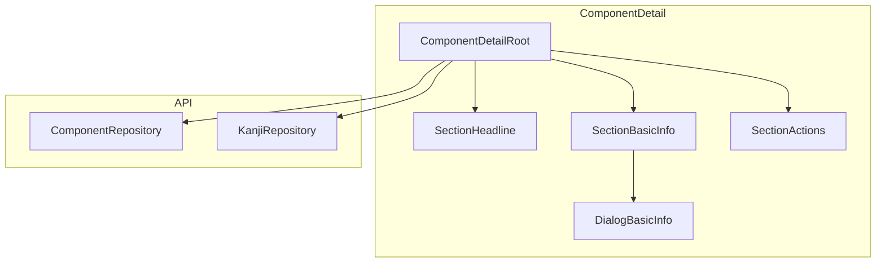

# Design Document: Component Detail Basic Information

## Overview

**Purpose**: This feature delivers the Basic Information section for the refactored Component Detail page, enabling users to view and edit component attributes (stroke count, source kanji, radical status) and radical-specific attributes (Kangxi number, meaning, Japanese name).

**Users**: Kanji researchers and learners who document component metadata for building their personal kanji dictionary.

**Impact**: Replaces the legacy inline-editing `ComponentDetailBasicInfo.vue` with a dialog-based editing pattern consistent with other refactored sections.

### Goals

- Display component basic information in a consistent `SharedSection` layout
- Provide dialog-based editing for all general and radical attributes
- Maintain full feature parity with legacy implementation
- Follow established patterns from kanji-detail refactoring

### Non-Goals

- Component forms management (separate section)
- Component groupings management (separate section)
- Component description editing (separate section)
- Kanji occurrence management (separate section)

## Architecture

### Existing Architecture Analysis

The Component Detail page is partially refactored with:

- `ComponentDetailRoot.vue` — orchestrates data fetching and section coordination
- `ComponentDetailSectionHeadline.vue` — headline with dialog editing
- `ComponentDetailSectionActions.vue` — delete functionality

The Basic Information section will follow the same Root → Section → Dialog pattern.

### Architecture Pattern & Boundary Map



**Architecture Integration**:

- **Selected pattern**: Section + Dialog (presentation/editing separation)
- **Domain boundary**: UI module consumes API layer; no direct SQL in components
- **Existing patterns preserved**: SharedSection for layout, BaseDialog for editing
- **Steering compliance**: File size limits, CSS tokens, data-testid attributes

### Technology Stack

| Layer         | Choice / Version   | Role in Feature          | Notes                                             |
| ------------- | ------------------ | ------------------------ | ------------------------------------------------- |
| Frontend      | Vue 3 + TypeScript | Component implementation | Composition API, `<script setup>`                 |
| Validation    | Zod                | Form schema validation   | Reuse shared schemas                              |
| Forms         | vee-validate       | Form state management    | Optional for simple forms                         |
| UI Components | Reka UI (via Base) | Dialog, inputs, checkbox | BaseDialog, BaseInput, BaseCheckbox, BaseCombobox |

## Requirements Traceability

| Requirement | Summary                    | Components            | Interfaces                                  | Key Notes                                |
| ----------- | -------------------------- | --------------------- | ------------------------------------------- | ---------------------------------------- |
| 1.1–1.9     | Display basic info         | SectionBasicInfo      | Props: component, sourceKanji, kanjiOptions | SharedSection with view-only display     |
| 2.1–2.4     | Edit dialog opening        | SectionBasicInfo      | isDialogOpen state                          | Edit button in actions slot              |
| 3.1–3.7     | General attributes editing | DialogBasicInfo       | Form fields + validation                    | Stroke count, source kanji, canBeRadical |
| 4.1–4.6     | Radical attributes editing | DialogBasicInfo       | Conditional form fields                     | Kangxi number/meaning, radical name      |
| 5.1–5.6     | Save behavior              | DialogBasicInfo, Root | save event → handleSave                     | Single save event with all fields        |
| 6.1–6.4     | API integration            | ComponentRepository   | update(id, input)                           | Already implemented                      |
| 7.1–7.7     | Testing                    | All components        | Test files                                  | Unit + E2E                               |
| 8.1–8.7     | Architecture compliance    | All components        | File sizes, naming                          | ESLint enforcement                       |

## Components and Interfaces

| Component                       | Domain     | Intent                          | Req Coverage | Key Dependencies                                  | Contracts       |
| ------------------------------- | ---------- | ------------------------------- | ------------ | ------------------------------------------------- | --------------- |
| ComponentDetailSectionBasicInfo | UI/Section | Display basic info, open dialog | 1, 2         | SharedSection, DialogBasicInfo                    | Props, Events   |
| ComponentDetailDialogBasicInfo  | UI/Dialog  | Edit form for basic info        | 3, 4, 5      | BaseDialog, BaseInput, BaseCheckbox, BaseCombobox | Props, Events   |
| ComponentDetailRoot (update)    | UI/Root    | Data orchestration              | 5, 6         | ComponentRepo, KanjiRepo                          | Handler methods |

### UI Layer

#### ComponentDetailSectionBasicInfo

| Field        | Detail                                               |
| ------------ | ---------------------------------------------------- |
| Intent       | Display component basic information with edit button |
| Requirements | 1.1–1.9, 2.1–2.4                                     |

**Responsibilities & Constraints**

- Display stroke count, source kanji (with link), can-be-radical status
- Conditionally display radical attributes when `canBeRadical` is true
- Manage dialog open state
- Emit save event to parent

**Dependencies**

- Inbound: ComponentDetailRoot — component, sourceKanji, kanjiOptions props (P0)
- Outbound: ComponentDetailDialogBasicInfo — dialog rendering (P0)
- External: SharedSection — layout wrapper (P0)

**Contracts**: State [x]

##### Props Interface

```typescript
interface ComponentDetailSectionBasicInfoProps {
  component: Component
  /** Resolved source kanji entity for display and linking */
  sourceKanji: Kanji | null
  /** All kanji for source kanji selection in dialog */
  kanjiOptions: Kanji[]
}
```

##### Events Interface

```typescript
interface ComponentDetailSectionBasicInfoEmits {
  save: [data: BasicInfoSaveData]
}
```

**Implementation Notes**

- Use `SharedSection` with title "Basic Information" and `test-id="component-detail-basic-info"`
- Display "—" for null values
- RouterLink for source kanji pointing to `/component/${sourceKanji.id}` (if exists)
- Show radical attributes section only when `component.canBeRadical` is true

---

#### ComponentDetailDialogBasicInfo

| Field        | Detail                                           |
| ------------ | ------------------------------------------------ |
| Intent       | Form dialog for editing basic information fields |
| Requirements | 3.1–3.7, 4.1–4.6, 5.1–5.6                        |

**Responsibilities & Constraints**

- Render form fields for all editable attributes
- Validate stroke count (1–64) and Kangxi number (1–214)
- Show/hide radical fields based on `canBeRadical` toggle
- Emit structured save data on submit

**Dependencies**

- Inbound: SectionBasicInfo — open state, initial values (P0)
- Outbound: None
- External: BaseDialog, BaseInput, BaseCheckbox, BaseCombobox (P0)

**Contracts**: State [x]

##### Props Interface

```typescript
interface ComponentDetailDialogBasicInfoProps {
  open: boolean
  component: Component
  sourceKanji: Kanji | null
  kanjiOptions: Kanji[]
}
```

##### Events Interface

```typescript
interface ComponentDetailDialogBasicInfoEmits {
  'update:open': [open: boolean]
  save: [data: BasicInfoSaveData]
}
```

##### Form State

```typescript
// Local refs reset when dialog opens
strokeCount: Ref<number | null>
strokeCountError: Ref<string | undefined>
sourceKanjiId: Ref<string> // String for combobox, "__none__" sentinel
canBeRadical: Ref<boolean>
kangxiNumber: Ref<number | null>
kangxiNumberError: Ref<string | undefined>
kangxiMeaning: Ref<string>
radicalNameJapanese: Ref<string>
```

**Implementation Notes**

- Watch `open` prop to reset form values from `component` prop
- Use `NONE_VALUE = "__none__"` sentinel for empty source kanji selection
- Validate on submit, block save if errors
- Clear radical fields when `canBeRadical` toggled off (optional: only on save)

---

#### ComponentDetailRoot (Update)

| Field        | Detail                                        |
| ------------ | --------------------------------------------- |
| Intent       | Add kanji loading and basic info save handler |
| Requirements | 5.1–5.2, 6.1–6.4                              |

**Responsibilities & Constraints**

- Load all kanji for source kanji selection
- Load source kanji entity from component's `sourceKanjiId`
- Handle save event from BasicInfo section

**Dependencies**

- Inbound: Route params (P0)
- Outbound: ComponentRepo, KanjiRepo (P0)
- External: None

**Contracts**: State [x]

##### Additional State

```typescript
// Add to existing Root
kanjiOptions: Ref<Kanji[]>
sourceKanji: Ref<Kanji | null>
```

##### Handler Method

```typescript
function handleBasicInfoSave(data: BasicInfoSaveData): void {
  if (!component.value) return
  try {
    componentRepo.update(component.value.id, data)
    component.value = { ...component.value, ...data }
    // Reload source kanji if changed
    if (data.sourceKanjiId !== component.value.sourceKanjiId) {
      sourceKanji.value = data.sourceKanjiId
        ? kanjiRepo.getById(data.sourceKanjiId)
        : null
    }
    toast.success('Component updated successfully')
  } catch (err) {
    toast.error(err instanceof Error ? err.message : 'Failed to update')
  }
}
```

## Data Models

### Domain Model

No new entities. Uses existing `Component` and `Kanji` entities.

### BasicInfoSaveData Type

```typescript
/**
 * Data emitted when basic info fields are saved
 */
interface BasicInfoSaveData {
  strokeCount: number | null
  sourceKanjiId: number | null
  canBeRadical: boolean
  kangxiNumber: number | null
  kangxiMeaning: string | null
  radicalNameJapanese: string | null
}
```

Add to `component-detail-types.ts`.

## Error Handling

### Error Strategy

- **Validation errors**: Inline field errors below inputs (stroke count, Kangxi number)
- **Save failures**: Toast notification with error message
- **Not found**: Handled by Root component (already implemented)

### Error Categories

| Error Type            | Trigger              | Response                |
| --------------------- | -------------------- | ----------------------- |
| Stroke count invalid  | Value < 1 or > 64    | Field error, block save |
| Kangxi number invalid | Value < 1 or > 214   | Field error, block save |
| Database error        | Save operation fails | Toast error message     |

## Testing Strategy

### Unit Tests

**ComponentDetailSectionBasicInfo.test.ts**

- Renders stroke count value or "—"
- Renders source kanji with link or "—"
- Renders can-be-radical status
- Shows radical attributes when canBeRadical is true
- Hides radical attributes when canBeRadical is false
- Opens dialog on Edit button click
- Emits save event when dialog saves

**ComponentDetailDialogBasicInfo.test.ts**

- Renders all form fields
- Populates fields with component values on open
- Shows radical fields when canBeRadical is checked
- Hides radical fields when canBeRadical is unchecked
- Validates stroke count range
- Validates Kangxi number range
- Emits save with correct data
- Closes on Cancel without saving

### E2E Tests

**component-detail.test.ts** (extend existing)

- Edit basic information flow: click Edit → modify fields → save → verify updated display
- Validation flow: enter invalid stroke count → see error → fix → save succeeds
- Toggle radical status: enable canBeRadical → fill radical fields → save → verify display
- Source kanji selection: select kanji → save → verify link displays

## File Structure

```
src/modules/component-detail/
├── components/
│   ├── ComponentDetailSectionBasicInfo.vue       # NEW
│   ├── ComponentDetailSectionBasicInfo.test.ts   # NEW
│   ├── ComponentDetailDialogBasicInfo.vue        # NEW
│   ├── ComponentDetailDialogBasicInfo.test.ts    # NEW
│   ├── ComponentDetailRoot.vue                   # UPDATE
│   └── ComponentDetailRoot.test.ts               # UPDATE
├── schemas/
│   ├── component-detail-basic-info-schema.ts     # NEW (optional)
│   └── component-detail-basic-info-schema.test.ts # NEW (optional)
└── component-detail-types.ts                     # UPDATE
```

## Implementation Notes

### Data-testid Attributes

| Element                | Test ID                       |
| ---------------------- | ----------------------------- |
| Section container      | `component-detail-basic-info` |
| Edit button            | `basic-info-edit-button`      |
| Stroke count display   | `basic-info-stroke-count`     |
| Source kanji display   | `basic-info-source-kanji`     |
| Can be radical display | `basic-info-can-be-radical`   |
| Kangxi number display  | `basic-info-kangxi-number`    |
| Kangxi meaning display | `basic-info-kangxi-meaning`   |
| Radical name display   | `basic-info-radical-name`     |

### CSS Class Naming

- Section: `component-detail-section-basic-info-*`
- Dialog: `component-detail-dialog-basic-info-*`

### Validation Rules

| Field         | Rule          | Error Message                             |
| ------------- | ------------- | ----------------------------------------- |
| Stroke Count  | 1–64 or null  | "Stroke count must be between 1 and 64"   |
| Kangxi Number | 1–214 or null | "Kangxi number must be between 1 and 214" |
