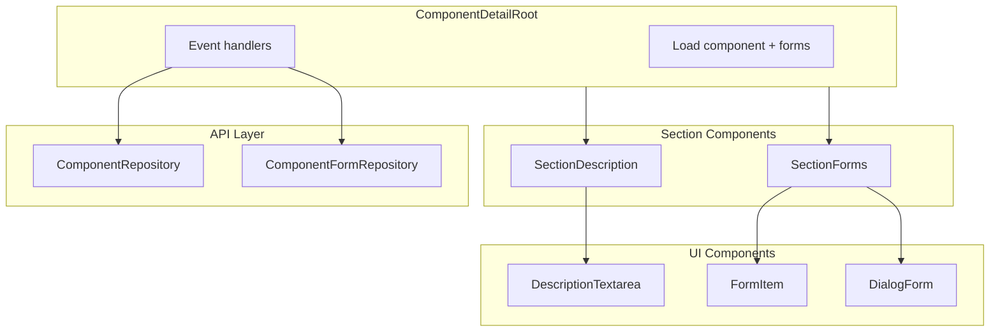

# Design Document: Component Detail Description & Forms

## Overview

**Purpose**: This feature adds the Description section and Forms Management section to the refactored Component Detail page, replicating all functionality from the legacy implementation using the new architecture patterns.

**Users**: Users documenting kanji components will use Description to record semantic meanings and Forms to track visual variants (e.g., 水 → 氵).

**Impact**: Extends the existing ComponentDetailRoot with two new sections, following established patterns from kanji-detail and component-detail-basic-info refactoring.

### Goals

- Full feature parity with legacy Description and Forms sections
- Use SharedSection with collapsible behavior for both sections
- Add Form button in actions slot, hidden when collapsed
- Inline save-on-blur for description editing
- Dialog-based CRUD for forms with reordering support
- Destructive mode gating for delete operations
- Comprehensive unit and E2E test coverage

### Non-Goals

- Changes to component form API (already complete)
- Form assignment to occurrences (separate feature)
- Component groupings (separate feature)

## Architecture

### Existing Architecture Analysis

Current component-detail module structure:

- `ComponentDetailRoot.vue` — Orchestrates data, renders sections
- `ComponentDetailSectionBasicInfo.vue` — Grid display with edit dialog
- `ComponentDetailSectionHeadline.vue` — Character display with edit dialog
- `ComponentDetailSectionActions.vue` — Destructive mode toggle, delete button

**Integration points**:

- Root loads component via `useComponentRepository()`
- Root manages `isDestructiveMode` state
- Sections receive data via props, emit events for mutations
- Toast notifications via `useToast()`

### Architecture Pattern & Boundary Map



**Architecture Integration**:

- Selected pattern: Root/Section/UI hierarchy (existing)
- Domain boundaries: Root owns data fetching, sections own UI state
- Existing patterns preserved: Props down, events up; dialog-based editing
- New components: 2 sections, 3 UI components, 1 dialog
- Steering compliance: File size limits, CSS variables, TypeScript strict

### Technology Stack

| Layer      | Choice / Version           | Role in Feature                | Notes                   |
| ---------- | -------------------------- | ------------------------------ | ----------------------- |
| Frontend   | Vue 3.5+ / Composition API | Section & UI components        | `<script setup>`        |
| State      | Component local refs       | Dialog open/close, edit values | No Pinia needed         |
| Validation | zod 3.x                    | Form dialog validation         | Match existing schemas  |
| Components | Reka UI / BaseDialog       | Dialog primitives              | Via SharedConfirmDialog |
| Testing    | Vitest / Playwright        | Unit + E2E                     | Colocated tests         |

## Requirements Traceability

| Requirement | Summary              | Components                              | Interfaces         | Flows            |
| ----------- | -------------------- | --------------------------------------- | ------------------ | ---------------- |
| 1.1-1.5     | Description display  | SectionDescription, DescriptionTextarea | —                  | —                |
| 2.1-2.5     | Description editing  | DescriptionTextarea                     | save event         | blur → save      |
| 3.1-3.5     | Forms display        | SectionForms, FormItem                  | —                  | —                |
| 4.1-4.3     | Add button placement | SectionForms                            | actions slot       | —                |
| 5.1-5.5     | Add form dialog      | DialogForm, SectionForms                | add event          | dialog → create  |
| 6.1-6.5     | Edit form dialog     | DialogForm, SectionForms                | update event       | dialog → update  |
| 7.1-7.6     | Delete form          | SectionForms, SharedConfirmDialog       | remove event       | confirm → delete |
| 8.1-8.6     | Form reordering      | SectionForms, FormItem                  | reorder event      | arrows → reorder |
| 9.1-9.5     | API integration      | Root handlers                           | Repository methods | —                |
| 10.1-10.5   | Test coverage        | All components                          | —                  | —                |

## Components and Interfaces

| Component                          | Domain/Layer | Intent                            | Req Coverage          | Key Dependencies        | Contracts |
| ---------------------------------- | ------------ | --------------------------------- | --------------------- | ----------------------- | --------- |
| ComponentDetailRoot                | Root         | Add forms data loading + handlers | 9.1-9.5               | ComponentFormRepository | —         |
| ComponentDetailSectionDescription  | Section      | Description display + editing     | 1.1-1.5, 2.1-2.5      | SharedSection           | Event     |
| ComponentDetailDescriptionTextarea | UI           | Inline textarea with save-on-blur | 2.1-2.5               | —                       | Event     |
| ComponentDetailSectionForms        | Section      | Forms list + CRUD orchestration   | 3-8                   | SharedSection           | Event     |
| ComponentDetailFormItem            | UI           | Single form display + actions     | 3.2, 7.1-7.2, 8.1-8.5 | BaseButton              | Event     |
| ComponentDetailDialogForm          | UI           | Add/Edit form dialog              | 5.1-5.5, 6.1-6.5      | BaseDialog              | Event     |

### Root Layer

#### ComponentDetailRoot (Extension)

| Field        | Detail                              |
| ------------ | ----------------------------------- |
| Intent       | Add forms loading and CRUD handlers |
| Requirements | 9.1-9.5                             |

**New Responsibilities**:

- Load forms via `useComponentFormRepository().getByParentId(componentId)`
- Handle description save event
- Handle form add/update/remove/reorder events
- Pass `isDestructiveMode` to forms section

**New Dependencies**:

- Inbound: SectionDescription.save, SectionForms.add/update/remove/reorder — P0
- Outbound: ComponentFormRepository — P0

**New State**:

```typescript
const forms = ref<ComponentForm[]>([])
```

**New Handlers**:

```typescript
function handleDescriptionSave(description: string | null): void
function handleFormAdd(data: CreateComponentFormInput): void
function handleFormUpdate(id: number, data: UpdateComponentFormInput): void
function handleFormRemove(id: number): void
function handleFormReorder(ids: number[]): void
```

### Section Layer

#### ComponentDetailSectionDescription

| Field        | Detail                                              |
| ------------ | --------------------------------------------------- |
| Intent       | Collapsible section with inline description editing |
| Requirements | 1.1-1.5, 2.1-2.5                                    |

**Responsibilities**:

- Render SharedSection with title "Description"
- Collapsible, default open when description exists
- Contain DescriptionTextarea for inline editing

**Dependencies**:

- Inbound: Root provides `description: string | null` — P0
- Outbound: Emits `save` event with new value — P0

**Props Interface**:

```typescript
interface Props {
  /** Current description value */
  description: string | null
}
```

**Events**:

```typescript
interface Emits {
  /** Emitted when description is saved */
  save: [value: string | null]
}
```

**Implementation Notes**:

- Use SharedSection with `collapsible` and `default-open` based on content
- Test ID: `component-detail-description`

---

#### ComponentDetailSectionForms

| Field        | Detail                                       |
| ------------ | -------------------------------------------- |
| Intent       | Collapsible section with forms list and CRUD |
| Requirements | 3.1-3.5, 4.1-4.3, 5-8                        |

**Responsibilities**:

- Render SharedSection with title "Forms"
- Show Add Form button in actions slot (hidden when collapsed)
- Render forms list or empty state
- Manage add/edit dialog state
- Manage delete confirmation dialog state
- Emit CRUD events to Root

**Dependencies**:

- Inbound: Root provides `forms`, `componentId`, `isDestructiveMode` — P0
- Outbound: SharedSection, FormItem, DialogForm, SharedConfirmDialog — P0

**Props Interface**:

```typescript
interface Props {
  /** List of component forms */
  forms: ComponentForm[]
  /** Parent component ID for creating forms */
  componentId: number
  /** Whether destructive mode is enabled */
  isDestructiveMode: boolean
}
```

**Events**:

```typescript
interface Emits {
  add: [data: Omit<CreateComponentFormInput, 'componentId'>]
  update: [id: number, data: UpdateComponentFormInput]
  remove: [id: number]
  reorder: [ids: number[]]
}
```

**State**:

```typescript
const showAddDialog = ref(false)
const showEditDialog = ref(false)
const showDeleteDialog = ref(false)
const editingForm = ref<ComponentForm | null>(null)
const deletingForm = ref<ComponentForm | null>(null)
```

**Implementation Notes**:

- Use `<template #actions="{ isOpen }">` pattern for conditional Add button
- Test ID: `component-detail-forms`
- Empty state message: "No forms added yet. Forms represent visual variants like 氵 vs 水."

### UI Layer

#### ComponentDetailDescriptionTextarea

| Field        | Detail                                     |
| ------------ | ------------------------------------------ |
| Intent       | Inline textarea with save-on-blur behavior |
| Requirements | 2.1-2.5                                    |

**Responsibilities**:

- Display description text or placeholder
- Click to enter edit mode
- Save on blur (with debounce)
- Handle empty → null conversion

**Props Interface**:

```typescript
interface Props {
  /** Current description value */
  modelValue: string | null
  /** Placeholder text */
  placeholder?: string
}
```

**Events**:

```typescript
interface Emits {
  save: [value: string | null]
}
```

**Implementation Notes**:

- Adapt from KanjiDetailNotesTextarea pattern
- Use save-on-blur instead of explicit save button
- Test ID: `description-textarea`

---

#### ComponentDetailFormItem

| Field        | Detail                                                |
| ------------ | ----------------------------------------------------- |
| Intent       | Display single form with edit/delete/reorder controls |
| Requirements | 3.2, 7.1-7.2, 8.1-8.5                                 |

**Responsibilities**:

- Display: character, name, stroke count (with 画 suffix), usage notes
- Reorder buttons (up/down arrows)
- Edit button
- Delete button (conditional on destructive mode)

**Props Interface**:

```typescript
interface Props {
  form: ComponentForm
  /** Position in list for reorder button state */
  index: number
  /** Total forms count for reorder button state */
  total: number
  /** Show delete button */
  isDestructiveMode: boolean
}
```

**Events**:

```typescript
interface Emits {
  edit: []
  delete: []
  'move-up': []
  'move-down': []
}
```

**Implementation Notes**:

- Disable up arrow when index === 0
- Disable down arrow when index === total - 1
- Test ID: `form-item-{form.id}`

---

#### ComponentDetailDialogForm

| Field        | Detail                                     |
| ------------ | ------------------------------------------ |
| Intent       | Dialog for adding or editing form variants |
| Requirements | 5.1-5.5, 6.1-6.5                           |

**Responsibilities**:

- Display form fields: character, form name, stroke count, usage notes
- Character editable only in add mode
- Validate required character field
- Submit/cancel handling

**Props Interface**:

```typescript
interface Props {
  /** Whether dialog is open */
  open: boolean
  /** Form to edit (null for add mode) */
  form: ComponentForm | null
}
```

**Events**:

```typescript
interface Emits {
  'update:open': [value: boolean]
  /** Add mode: Omit componentId */
  submit: [
    data: {
      formCharacter: string
      formName: string | null
      strokeCount: number | null
      usageNotes: string | null
    }
  ]
  cancel: []
}
```

**State**:

```typescript
const formValues = ref({
  formCharacter: '',
  formName: '',
  strokeCount: '',
  usageNotes: ''
})
```

**Implementation Notes**:

- Title: "Add Form Variant" or "Edit Form Variant"
- Character field disabled in edit mode
- Use BaseDialog with form inside
- Test ID: `dialog-form`

## Data Models

### Existing Entities (No Changes)

**Component** (relevant field):

```typescript
interface Component {
  // ... existing fields
  description: string | null
}
```

**ComponentForm** (existing):

```typescript
interface ComponentForm {
  id: number
  componentId: number
  formCharacter: string
  formName: string | null
  strokeCount: number | null
  usageNotes: string | null
  displayOrder: number
  createdAt: string
  updatedAt: string
}
```

### Input Types (Existing)

```typescript
interface CreateComponentFormInput {
  componentId: number
  formCharacter: string
  formName?: string | null
  strokeCount?: number | null
  usageNotes?: string | null
  displayOrder?: number
}

interface UpdateComponentFormInput {
  formCharacter?: string
  formName?: string | null
  strokeCount?: number | null
  usageNotes?: string | null
}
```

## Error Handling

### Error Categories

| Category       | Scenario        | User Message                 | Recovery                 |
| -------------- | --------------- | ---------------------------- | ------------------------ |
| Validation     | Empty character | "Character is required"      | Show inline error        |
| Save Failure   | API error       | "Failed to save description" | Toast notification       |
| Create Failure | API error       | "Failed to add form"         | Toast + keep dialog open |
| Delete Failure | API error       | "Failed to delete form"      | Toast notification       |

### Monitoring

- Console errors logged for debugging
- Toast notifications for all mutation outcomes

## Testing Strategy

### Unit Tests

| Component                          | Test Cases                                      |
| ---------------------------------- | ----------------------------------------------- |
| ComponentDetailDescriptionTextarea | Displays value, placeholder, emits save on blur |
| ComponentDetailFormItem            | Displays fields, emits events, button states    |
| ComponentDetailDialogForm          | Form validation, submit data, edit mode         |
| ComponentDetailSectionDescription  | Collapsible behavior, save event                |
| ComponentDetailSectionForms        | Empty state, list render, dialog triggers       |

### Integration Tests

- Root + Description: Save flow with toast
- Root + Forms: CRUD operations with repository calls

### E2E Tests

| Test Case                        | Coverage         |
| -------------------------------- | ---------------- |
| Description inline edit and save | 1.1-2.5          |
| Add form via dialog              | 4.1-5.5          |
| Edit form via dialog             | 6.1-6.5          |
| Delete form with confirmation    | 7.1-7.6          |
| Reorder forms with arrows        | 8.1-8.6          |
| Forms persist after reload       | Data persistence |

### Test File Organization

```
src/modules/component-detail/
├── components/
│   ├── ComponentDetailDescriptionTextarea.test.ts
│   ├── ComponentDetailFormItem.test.ts
│   ├── ComponentDetailDialogForm.test.ts
│   ├── ComponentDetailSectionDescription.test.ts
│   └── ComponentDetailSectionForms.test.ts
e2e/
└── component-detail.test.ts (extend existing)
```

## File Organization

### New Files

```
src/modules/component-detail/
├── components/
│   ├── ComponentDetailSectionDescription.vue      (~80 lines)
│   ├── ComponentDetailDescriptionTextarea.vue     (~100 lines)
│   ├── ComponentDetailSectionForms.vue            (~180 lines)
│   ├── ComponentDetailFormItem.vue                (~120 lines)
│   └── ComponentDetailDialogForm.vue              (~150 lines)
├── schemas/
│   └── component-form-schema.ts                   (~30 lines)
```

### Modified Files

```
src/modules/component-detail/
├── components/
│   └── ComponentDetailRoot.vue                    (+60 lines, total ~210)
├── component-detail-types.ts                      (+20 lines)
├── index.ts                                       (+exports)
e2e/
└── component-detail.test.ts                       (+100 lines)
```

## Supporting References

### SharedSection Actions Slot Pattern

From [KanjiSectionStrokeOrder.vue](src/modules/kanji-detail/components/KanjiSectionStrokeOrder.vue#L62-L72):

```vue
<template #actions="{ isOpen }">
  <BaseButton
    v-if="!isEditMode && isOpen"
    data-testid="stroke-order-edit-button"
    size="sm"
    variant="secondary"
    @click="handleEdit"
  >
    Edit
  </BaseButton>
</template>
```

Apply same pattern for Add Form button visibility.
