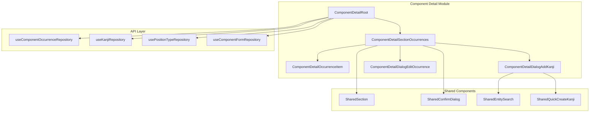

# Design Document

## Overview

**Purpose**: This feature delivers a refactored Kanji Occurrences section for the Component Detail page, enabling users to view and manage all kanji that use a specific component.

**Users**: Kanji researchers documenting component-kanji relationships and analyzing how components appear in different kanji with various positions and forms.

**Impact**: Replaces legacy inline-editing approach with dialog-based editing pattern, consistent with other refactored sections. Adds missing API method for joined occurrence data.

### Goals

- Full feature parity with legacy `ComponentDetailKanjiList.vue`
- Dialog-based editing (position, form, radical, notes) instead of inline
- Consistent UI pattern with Forms section
- Proper API layer integration

### Non-Goals

- Groupings functionality (separate section, future spec)
- Bulk operations on multiple occurrences
- Advanced filtering/sorting of occurrences

## Architecture

### Architecture Pattern & Boundary Map



**Architecture Integration**:

- Selected pattern: Root/Section/UI hierarchy
- Domain boundary: Component-detail module owns occurrence section UI
- API layer: Occurrence repository extended with joined query
- Steering compliance: File size limits, dialog-based editing

### Technology Stack

| Layer         | Choice                           | Role in Feature                   |
| ------------- | -------------------------------- | --------------------------------- |
| UI Components | Vue 3 + Reka UI                  | Section, dialogs, combobox search |
| State         | Composables                      | Occurrence data, dialog state     |
| Data          | useComponentOccurrenceRepository | CRUD operations with joins        |
| Validation    | Zod (if needed)                  | Form validation in edit dialog    |

## Requirements Traceability

| Req | Summary                 | Components                              | Key Interfaces                    |
| --- | ----------------------- | --------------------------------------- | --------------------------------- |
| 1   | Section display         | SectionOccurrences, SharedSection       | Props: occurrences, componentId   |
| 2   | Add button placement    | SectionOccurrences                      | Slot: actions                     |
| 3   | Add kanji dialog        | DialogAddKanji, SharedEntitySearch      | Events: select, create            |
| 4   | Quick create kanji      | SharedQuickCreateKanji                  | Props: initialCharacter           |
| 5   | Occurrence item display | OccurrenceItem                          | Props: occurrence, forms          |
| 6   | Edit occurrence dialog  | DialogEditOccurrence                    | Props: occurrence, positionTypes  |
| 7   | Radical flag behavior   | OccurrenceRepository                    | Method: update with isRadical     |
| 8   | Delete functionality    | SectionOccurrences, SharedConfirmDialog | Event: remove                     |
| 9   | Reordering              | OccurrenceItem, SectionOccurrences      | Events: move-up, move-down        |
| 10  | Navigation              | OccurrenceItem                          | RouterLink to kanji detail        |
| 11  | API integration         | OccurrenceRepository                    | Method: getByComponentIdWithKanji |
| 12  | Position/form dropdowns | DialogEditOccurrence                    | Props: positionTypes, forms       |
| 13  | Test coverage           | All components                          | Unit + E2E tests                  |

## Components and Interfaces

### Summary

| Component                           | Layer   | Intent                                  | Req Coverage |
| ----------------------------------- | ------- | --------------------------------------- | ------------ |
| ComponentDetailSectionOccurrences   | Section | Orchestrates occurrence list with CRUD  | 1, 2, 8, 9   |
| ComponentDetailOccurrenceItem       | UI      | Displays single occurrence with actions | 5, 9, 10     |
| ComponentDetailDialogAddKanji       | Dialog  | Search and link kanji                   | 3, 4         |
| ComponentDetailDialogEditOccurrence | Dialog  | Edit occurrence metadata                | 6, 7, 12     |
| SharedEntitySearch                  | Shared  | Searchable entity combobox              | 3            |
| SharedQuickCreateKanji              | Shared  | Quick kanji creation form               | 4            |

### Component Detail Module

#### ComponentDetailSectionOccurrences

| Field        | Detail                                               |
| ------------ | ---------------------------------------------------- |
| Intent       | Section wrapper managing occurrence list and dialogs |
| Requirements | 1, 2, 8, 9                                           |

**Responsibilities & Constraints**

- Wraps content in SharedSection with collapsible behavior
- Manages dialog open/close state for add, edit, delete
- Emits events to parent for data operations
- Controls Add button visibility based on collapse state

**Dependencies**

- Inbound: ComponentDetailRoot — provides occurrences, forms, positionTypes (P0)
- Outbound: SharedSection, SharedConfirmDialog, DialogAddKanji, DialogEditOccurrence, OccurrenceItem (P0)

**Contracts**: State [ ]

##### Props Interface

```typescript
interface ComponentDetailSectionOccurrencesProps {
  /** List of occurrences with joined kanji and position data */
  occurrences: OccurrenceWithKanji[]
  /** Parent component ID */
  componentId: number
  /** Available forms for this component */
  forms: ComponentForm[]
  /** Position types for dropdown */
  positionTypes: PositionType[]
  /** Whether destructive mode is enabled */
  isDestructiveMode: boolean
  /** All kanji for search (excluding already linked) */
  allKanji: Kanji[]
}
```

##### Emits Interface

```typescript
interface ComponentDetailSectionOccurrencesEmits {
  /** Link a kanji to this component */
  add: [kanjiId: number]
  /** Create new kanji and link it */
  create: [data: QuickCreateKanjiData]
  /** Update occurrence metadata */
  update: [id: number, data: OccurrenceUpdateData]
  /** Remove occurrence */
  remove: [id: number]
  /** Reorder occurrences */
  reorder: [ids: number[]]
}
```

#### ComponentDetailOccurrenceItem

| Field        | Detail                                                          |
| ------------ | --------------------------------------------------------------- |
| Intent       | Display single occurrence with character, metadata, and actions |
| Requirements | 5, 9, 10                                                        |

**Responsibilities & Constraints**

- Display kanji character as RouterLink
- Show position badge, form badge, radical badge
- Show truncated analysis notes with expand
- Render reorder buttons (up/down)
- Render edit/delete action buttons

**Dependencies**

- Inbound: SectionOccurrences — provides occurrence data (P0)
- Outbound: BaseButton, RouterLink, SharedPositionBadge (P0)

**Contracts**: None (pure presentation)

##### Props Interface

```typescript
interface ComponentDetailOccurrenceItemProps {
  /** Occurrence with joined data */
  occurrence: OccurrenceWithKanji
  /** Available forms for display */
  forms: ComponentForm[]
  /** Position in list */
  index: number
  /** Total items for button state */
  total: number
  /** Show delete button */
  isDestructiveMode: boolean
}
```

##### Emits Interface

```typescript
interface ComponentDetailOccurrenceItemEmits {
  edit: []
  delete: []
  'move-up': []
  'move-down': []
}
```

#### ComponentDetailDialogAddKanji

| Field        | Detail                                        |
| ------------ | --------------------------------------------- |
| Intent       | Dialog with searchable kanji list for linking |
| Requirements | 3, 4                                          |

**Responsibilities & Constraints**

- Display searchable list of available kanji
- Filter out already-linked kanji IDs
- Trigger quick-create flow when search yields no results
- Close on selection

**Dependencies**

- Inbound: SectionOccurrences — provides allKanji, excludedIds (P0)
- Outbound: BaseDialog, SharedEntitySearch, SharedQuickCreateKanji (P0)

**Contracts**: None

##### Props Interface

```typescript
interface ComponentDetailDialogAddKanjiProps {
  /** Whether dialog is open */
  open: boolean
  /** All kanji for search */
  allKanji: Kanji[]
  /** IDs of kanji already linked (to exclude) */
  excludedKanjiIds: number[]
}
```

##### Emits Interface

```typescript
interface ComponentDetailDialogAddKanjiEmits {
  'update:open': [open: boolean]
  /** Select existing kanji */
  select: [kanjiId: number]
  /** Create new kanji */
  create: [data: QuickCreateKanjiData]
}
```

#### ComponentDetailDialogEditOccurrence

| Field        | Detail                                      |
| ------------ | ------------------------------------------- |
| Intent       | Form dialog for editing occurrence metadata |
| Requirements | 6, 7, 12                                    |

**Responsibilities & Constraints**

- Display kanji character as read-only context
- Position dropdown with "None" option
- Form dropdown with "None" option (only if forms exist)
- Is Radical checkbox
- Analysis notes textarea
- Save/Cancel actions

**Dependencies**

- Inbound: SectionOccurrences — provides occurrence, positionTypes, forms (P0)
- Outbound: BaseDialog, BaseSelect, BaseCheckbox, BaseTextarea, BaseButton (P0)

**Contracts**: None

##### Props Interface

```typescript
interface ComponentDetailDialogEditOccurrenceProps {
  /** Whether dialog is open */
  open: boolean
  /** Occurrence to edit */
  occurrence: OccurrenceWithKanji | null
  /** Position type options */
  positionTypes: PositionType[]
  /** Form options for this component */
  forms: ComponentForm[]
}
```

##### Emits Interface

```typescript
interface ComponentDetailDialogEditOccurrenceEmits {
  'update:open': [open: boolean]
  submit: [data: OccurrenceUpdateData]
  cancel: []
}
```

### API Layer Extensions

#### OccurrenceWithKanji Type

```typescript
interface OccurrenceWithKanji {
  id: number
  kanjiId: number
  componentId: number
  componentFormId: number | null
  positionTypeId: number | null
  isRadical: boolean
  analysisNotes: string | null
  displayOrder: number
  createdAt: string
  updatedAt: string
  /** Joined kanji entity */
  kanji: Kanji
  /** Joined position type (if set) */
  position: PositionType | null
}
```

#### OccurrenceUpdateData Type

```typescript
interface OccurrenceUpdateData {
  positionTypeId: number | null
  componentFormId: number | null
  isRadical: boolean
  analysisNotes: string | null
}
```

#### Repository Extension

```typescript
interface ComponentOccurrenceRepository {
  // Existing methods...

  /** Get occurrences by component with joined kanji and position data */
  getByComponentIdWithKanji(componentId: number): OccurrenceWithKanji[]
}
```

### Shared Components (Migration Required)

#### SharedEntitySearch

Migrate from `src/legacy/shared/components/SharedEntitySearch.vue` to `src/shared/components/`.

**Interface** (existing):

```typescript
interface SharedEntitySearchProps {
  entityType: 'kanji' | 'component'
  options: EntityOption[]
  excludeIds?: number[]
  placeholder?: string
  label?: string
  disabled?: boolean
}

interface SharedEntitySearchEmits {
  select: [entity: EntityOption]
  createNew: [searchTerm: string]
}
```

#### SharedQuickCreateKanji

Migrate from `src/legacy/shared/components/SharedQuickCreateKanji.vue` to `src/shared/components/`.

**Interface** (existing):

```typescript
interface SharedQuickCreateKanjiProps {
  open: boolean
  initialCharacter?: string
}

interface SharedQuickCreateKanjiEmits {
  'update:open': [open: boolean]
  create: [data: QuickCreateKanjiData]
  cancel: []
}
```

## Data Models

### Database Schema (Existing)

The `component_occurrences` table already exists:

```sql
CREATE TABLE component_occurrences (
  id INTEGER PRIMARY KEY,
  kanji_id INTEGER NOT NULL REFERENCES kanjis(id),
  component_id INTEGER NOT NULL REFERENCES components(id),
  component_form_id INTEGER REFERENCES component_forms(id),
  position_type_id INTEGER REFERENCES position_types(id),
  is_radical INTEGER DEFAULT 0,
  analysis_notes TEXT,
  display_order INTEGER DEFAULT 0,
  created_at TEXT DEFAULT CURRENT_TIMESTAMP,
  updated_at TEXT DEFAULT CURRENT_TIMESTAMP
);
```

### Join Query for getByComponentIdWithKanji

```sql
SELECT
  co.*,
  k.id as k_id, k.character as k_character, k.short_meaning as k_short_meaning,
  k.stroke_count as k_stroke_count,
  pt.id as pt_id, pt.position_name, pt.name_japanese, pt.name_english
FROM component_occurrences co
LEFT JOIN kanjis k ON co.kanji_id = k.id
LEFT JOIN position_types pt ON co.position_type_id = pt.id
WHERE co.component_id = ?
ORDER BY co.display_order
```

## Integration with ComponentDetailRoot

### Data Loading

Root loads occurrences alongside forms:

```typescript
// In ComponentDetailRoot.vue
const occurrences = ref<OccurrenceWithKanji[]>([])
const allKanji = ref<Kanji[]>([])
const positionTypes = ref<PositionType[]>([])

function loadComponent(): void {
  // ... existing loading ...
  occurrences.value = occurrenceRepo.getByComponentIdWithKanji(
    componentId.value
  )
  allKanji.value = kanjiRepo.getAll()
  positionTypes.value = positionTypeRepo.getAll()
}
```

### Event Handlers

Root handles occurrence events similar to forms:

```typescript
function handleOccurrenceAdd(kanjiId: number): void {
  occurrenceRepo.create({ kanjiId, componentId: component.value.id })
  occurrences.value = occurrenceRepo.getByComponentIdWithKanji(
    component.value.id
  )
  toast.success('Kanji linked')
}

function handleOccurrenceUpdate(id: number, data: OccurrenceUpdateData): void {
  occurrenceRepo.update(id, data)
  occurrences.value = occurrenceRepo.getByComponentIdWithKanji(
    component.value.id
  )
  toast.success('Occurrence updated')
}

function handleOccurrenceRemove(id: number): void {
  occurrenceRepo.remove(id)
  occurrences.value = occurrenceRepo.getByComponentIdWithKanji(
    component.value.id
  )
  toast.success('Kanji unlinked')
}

function handleOccurrenceReorder(ids: number[]): void {
  occurrenceRepo.reorder(ids)
  occurrences.value = occurrenceRepo.getByComponentIdWithKanji(
    component.value.id
  )
}
```

## File Size Estimates

| File                                          | Estimated Lines | Limit |
| --------------------------------------------- | --------------- | ----- |
| ComponentDetailSectionOccurrences.vue         | ~200            | 250   |
| ComponentDetailOccurrenceItem.vue             | ~150            | 200   |
| ComponentDetailDialogAddKanji.vue             | ~120            | 200   |
| ComponentDetailDialogEditOccurrence.vue       | ~180            | 200   |
| SharedEntitySearch.vue (migrated)             | ~200            | 200   |
| SharedQuickCreateKanji.vue (migrated)         | ~150            | 200   |
| component-occurrence-repository.ts (extended) | ~250            | 250   |
| component-detail-types.ts (extended)          | ~80             | 300   |

All files within limits.
