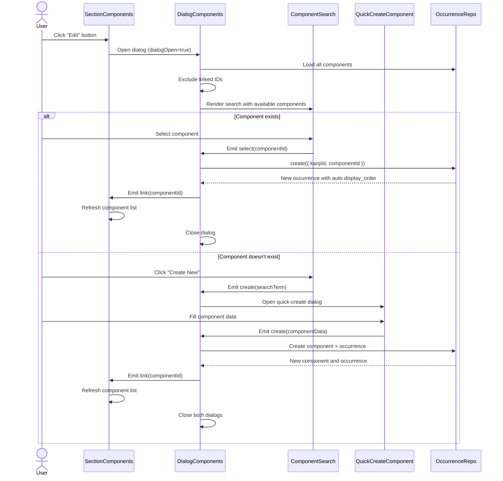
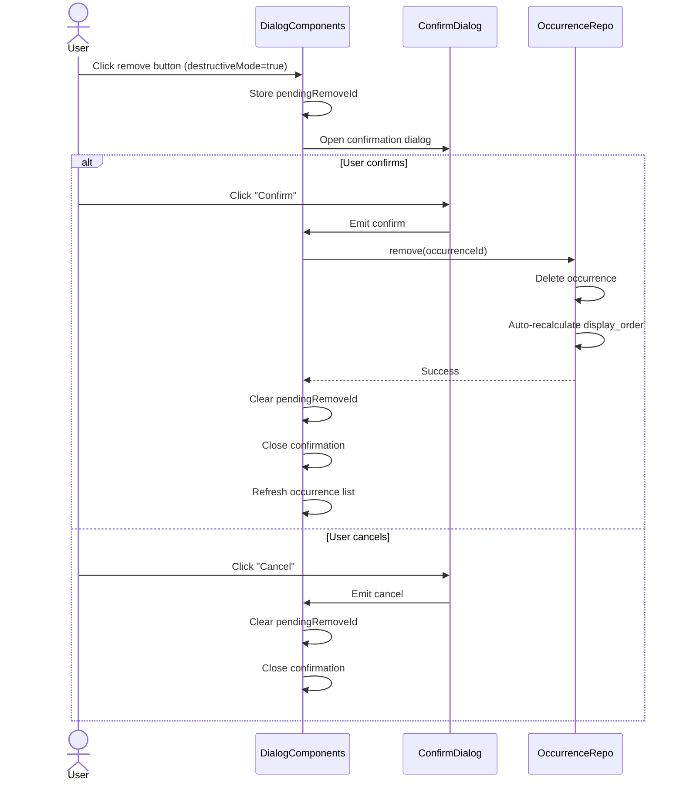

# Design Document: Kanji Detail Components Section

## Overview

This feature refactors the Components section of the kanji detail page from legacy inline editing to a modern dialog-based architecture. The refactored implementation follows the established vocabulary section pattern with a three-component structure (Section, Display, Dialog) using SharedSection for layout consistency. All functionality from the legacy implementation is preserved, including component linking, quick creation, position/form assignment, radical marking, and analysis notes.

**Purpose**: Enable users to manage component-kanji relationships through a clean dialog interface with mobile-responsive design and proper confirmation for destructive actions.

**Users**: Kanji researchers and learners documenting kanji compositional structure through component occurrences.

**Impact**: Replaces legacy inline editing UI with modern dialog-based workflow, improving mobile experience and maintaining consistency with other refactored sections (vocabulary, readings, meanings).

### Goals

- Replicate all legacy component section functionality in new architecture
- Use SharedSection component for consistent section layout
- Implement dialog-based editing matching vocabulary section pattern
- Support component search, linking, quick-creation, and occurrence editing
- Ensure mobile responsiveness with no horizontal scrolling
- Require confirmation for component unlinking in destructive mode
- Maintain complete API support for CRUD operations

### Non-Goals

- Manual drag-and-drop reordering of component occurrences (deferred)
- Advanced component filtering (by position, form, radical status)
- Bulk component operations (link multiple, unlink all)
- Importing components directly from legacy (all legacy code must be copied to new location)

## Architecture

### Existing Architecture Analysis

**Current State (Legacy)**:

- Single KanjiDetailComponents.vue component with inline editing
- Direct integration with legacy SharedEntitySearch
- Inline add/remove buttons in grid layout
- SharedQuickCreateComponent dialog for new components

**Integration Points to Maintain**:

- Component Occurrence Repository API (CRUD + reorder)
- Component Repository API (read operations for search)
- Position Type Repository (optional dropdown data)
- Component Form Repository (optional dropdown data)
- RouterLink navigation to /components/:id
- vee-validate + zod for all form validation

**Technical Debt Addressed**:

- Separation of view and edit concerns
- Mobile-responsive grid layout with design tokens
- Confirmation dialog for destructive actions
- TypeScript strict typing throughout
- No imports from legacy (copy components to new location)
- Handler logic extracted to composables (not in Root component)

### Architecture Pattern & Boundary Map

**Pattern**: Feature Module with Three-Tier Component Hierarchy (Root → Section → UI)

```mermaid
graph TB
    subgraph "Kanji Detail Module"
        Root[KanjiDetailRoot]
        Section[KanjiDetailSectionComponents]
        Display[KanjiDetailComponentsDisplay]
        Dialog[KanjiDetailDialogComponents]
        Item[KanjiDetailComponentItem]
        Search[KanjiDetailComponentSearch]
    end

        SharedQuickCreate[SharedQuickCreateComponent - copied from legacy]
        SharedPosition[SharedPositionBadge - copied from legacy
    subgraph "Legacy Shared (Temporary)"
        SharedQuickCreate[SharedQuickCreateComponent]
        SharedPosition[SharedPositionBadge]
    end

    subgraph "API Layer"
        OccurrenceRepo[useComponentOccurrenceRepository]
        ComponentRepo[useComponentRepository]
        PositionRepo[usePositionTypeRepository]
        FormRepo[useComponentFormRepository]
    end

    Root --> Section
    Section --> Display
    Section --> Dialog
    Section --> SharedSection
    Display --> Item
    Dialog --> Search
    Dialog --> SharedQuickCreate
    Dialog --> SharedConfirm
    Item --> SharedPosition
    Dialog --> OccurrenceRepo
    Dialog --> ComponentRepo
    Dialog --> PositionRepo
    Dialog --> FormRepo
```

**Architecture Integration**:

- **Pattern**: Three-component structure (Section/Display/Dialog) matching vocabulary refactor
- **Domain Boundaries**: Section owns component occurrence state, Dialog handles mutations, Display renders view-only grid
- **Existing Patterns Preserved**: SharedSection for layout, dialog-based editing, confirmation for destructive actions, vee-validate + zod for form validation
- **New Components Rationale**:
  - `KanjiDetailSectionComponents` - Orchestrates component occurrence display and editing
  - `KanjiDetailComponentsDisplay` - Pure presentation of occurrence grid with navigation links
  - `KanjiDetailDialogComponents` - Manages search, link, unlink, edit with confirmation and form validation
  - `KanjiDetailComponentItem` - Individual occurrence card with character, meaning, badges
  - `KanjiDetailComponentSearch` - Search interface for finding and selecting components
  - `use-kanji-detail-components-handlers.ts` - Handler composable to keep Root component within file size limits
  - `SharedQuickCreateComponent` - Copied from legacy to `src/shared/components/` and updated to follow new standards
  - `SharedPositionBadge` - Copied from legacy to `src/shared/components/` and updated to follow new standards
- **Steering Compliance**: Follows file size limits (Section ≤250, Dialog ≤250, Display ≤200, Item ≤200), uses design tokens, TypeScript strict mode, no legacy imports

### Technology Stack

| Layer    | Choice / Version                                               | Role in Feature                 | Notes                            |
| -------- | -------------------------------------------------------------- | ------------------------------- | -------------------------------- |
| Frontend | vee-validate + zod                                             | Form validation                 | All forms must use this pattern  |
| Frontend | Vue 3 (Composition API)                                        | Component implementation        | `<script setup>`, reactive state |
| Frontend | Reka UI (DialogRoot, DialogPortal, DialogContent, DialogClose) | Dialog primitives               | Headless accessible dialog       |
| Frontend | RouterLink                                                     | Navigation to component detail  | Vue Router integration           |
| Data     | Component Occurrence Repository                                | CRUD operations for occurrences | Existing API, full support       |
| Data     | Component Repository                                           | Read operations for search      | Existing API, queries only       |
| Data     | Position Type Repository                                       | Load position options           | Existing API, lookup table       |
| Data     | Component Form Repository                                      | Load form options for component | Existing API, child entities     |

## System Flows

### Component Linking Flow



### Component Unlinking Flow (Destructive Mode)



**Flow-Level Decisions**:

- Auto-recalculation of display_order on delete happens in repository layer (atomic operation)
- Quick-create flow creates both component and occurrence in sequence (not transactional, acceptable for SQLite)
- Dialog refresh re-queries occurrences from repository (single source of truth)
- Confirmation dialog state managed in Dialog component, not Section (localized concern)

## Requirements Traceability

| Requirement | Summary                       | Components                         | Interfaces                     | Flows                             |
| ----------- | ----------------------------- | ---------------------------------- | ------------------------------ | --------------------------------- |
| 1.1-1.7     | Display component occurrences | Display, Item, Section             | ComponentOccurrenceWithDetails | -                                 |
| 2.1-2.8     | Link components via dialog    | Dialog, Search, Section            | Dialog Events, Search Events   | Component Linking                 |
| 3.1-3.5     | Quick-create components       | Dialog, QuickCreate                | QuickCreateData                | Component Linking (create branch) |
| 4.1-4.5     | Edit and remove occurrences   | Dialog, Confirm                    | UpdateInput, Dialog Events     | Component Unlinking               |
| 5.1-5.4     | Navigate to component detail  | Item, Display                      | RouterLink props               | -                                 |
| 6.1-6.6     | Mobile responsiveness         | All UI components                  | Responsive CSS                 | -                                 |
| 8.1-8.7     | Destructive confirmation      | Dialog, Confirm                    | Confirmation state             | Component Unlinking               |
| 9.1-9.6     | Form validation               | Dialog, Search                     | Zod schemas, vee-validate      | Form submission                   |
| 10.1-10.11  | Testing and code quality      | All components                     | Test harness                   | -                                 |
| 11.1-11.10  | Pattern consistency           | Section, Dialog, Display, Handlers | SharedSection, Composable      |
| 8.1-8.7     | Pattern consistency           | Section, Dialog, Display           | SharedSection props            | -                                 |

| KanjiDetailSectionComponents | UI/Section | Orchestrate component occurrence display and editing | 1.1-1.5, 11.1-11.2 | SharedSection (P0), Display (P0), Dialog (P0) | State, Events |
| KanjiDetailComponentsDisplay | UI/Display | Render occurrence grid in view mode | 1.1-1.7, 5.1-5.2, 7.1-7.6, 11.3 | ComponentItem (P0) | Props |
| KanjiDetailDialogComponents | UI/Dialog | Manage linking, unlinking, editing via dialog | 2.1-2.8, 3.1-3.5, 4.1-4.5, 8.1-8.7, 9.1-9.6, 11.2-11.3 | Search (P0), QuickCreate (P0), ConfirmDialog (P0), Repos (P0) | State, API, Events |
| KanjiDetailComponentItem | UI/Item | Display individual occurrence card | 1.2, 1.6-1.7, 5.1-5.4, 7.1-7.6 | SharedPositionBadge (P0), RouterLink (P0) | Props |
| KanjiDetailComponentSearch | UI/Search | Search and select components for linking | 2.2-2.4, 3.1 | None | Events |
| use-kanji-detail-components-handlers | Composable | Extract handler logic from Root | 11.9-11.10 | Repositories (P0) | Service |2 | SharedSection (P0), Display (P0), Dialog (P0) | State, Events |
| KanjiDetailComponentsDisplay | UI/Display | Render occurrence grid in view mode | 1.1-1.7, 5.1-5.2, 8.3 | ComponentItem (P0) | Props |
| KanjiDetailDialogComponents | UI/Dialog | Manage linking, unlinking, editing via dialog | 2.1-2.8, 3.1-3.5, 4.1-4.5, 8.2-8.3 | Search (P0), QuickCreate (P1), ConfirmDialog (P0), Repos (P0) | State, API, Events |
| KanjiDetailComponentItem | UI/Item | Display individual occurrence card | 1.2, 1.6-1.7, 5.1-5.4 | SharedPositionBadge (P1), RouterLink (P0) | Props |
| KanjiDetailComponentSearch | UI/Search | Search and select components for linking | 2.2-2.4, 3.1 | None | Events |

### UI Layer

#### KanjiDetailSectionComponents

| Field        | Detail                                                                           |
| ------------ | -------------------------------------------------------------------------------- |
| Intent       | Orchestrate component occurrence display and editing using SharedSection pattern |
| Requirements | 1.1, 1.2, 1.3, 1.4, 1.5, 11.1, 11.2                                              |

**Responsibilities & Constraints**

- Wrap Display component with SharedSection for consistent layout
- Manage dialog open/close state
- Emit events to parent (Root) for API mutations
- Pass destructiveMode flag to Dialog for conditional delete button visibility
- Display "Edit" action button in SharedSection actions slot

**Dependencies**

- Inbound: Props from KanjiDetailRoot (occurrences, allComponents, destructiveMode)
- Outbound: Events to KanjiDetailRoot (link, unlink, create)
- Components: SharedSection (P0), KanjiDetailComponentsDisplay (P0), KanjiDetailDialogComponents (P0)

**Contracts**: State [x] / Events [x]

##### State Interface

```typescript
interface SectionState {
  dialogOpen: Ref<boolean>
}
```

**State Management**:

- `dialogOpen` toggled by "Edit" button click and dialog close events
- All data props passed through (no local mutations)

##### Props Interface

```typescript
interface KanjiDetailSectionComponentsProps {
  /** Component occurrences linked to current kanji */
  occurrences: ComponentOccurrenceWithDetails[]
  /** All available components for search */
  allComponents: Component[]
  /** Whether destructive mode is enabled (shows delete buttons) */
  destructiveMode?: boolean
}
```

**Preconditions**:

- `occurrences` array is sorted by display_order
- `allComponents` array contains valid components
- If `destructiveMode` true, user has explicitly enabled it in UI

##### Events Interface

```typescript
interface SectionComponentsEvents {
  /** Emitted when user links a component */
  link: [componentId: number]
  /** Emitted when user unlinks a component occurrence */
  unlink: [occurrenceId: number]
  /** Emitted when user creates new component and links it */
  create: [data: QuickCreateComponentData]
}
```

**Postconditions**:

- Events trigger API mutations in parent Root component
- Dialog closes after successful link/create
- Display refreshes after parent updates occurrences prop

#### KanjiDetailComponentsDisplay

| Field        | Detail                                                                     |
| ------------ | -------------------------------------------------------------------------- |
| Intent       | Render component occurrence grid in view mode with navigation links        |
| Requirements | 1.1, 1.2, 1.3, 1.4, 1.6, 1.7, 5.1, 5.2, 7.1, 7.2, 7.3, 7.4, 7.5, 7.6, 11.3 |

**Responsibilities & Constraints**

- Display occurrences in responsive grid layout (auto-fit, minmax(200px, 1fr))
- Render empty state when no occurrences exist
- Pass occurrence data to ComponentItem for individual rendering
- Use CSS design tokens for all styling (no hardcoded values)
- Ensure mobile responsiveness (no horizontal scroll)

**Dependencies**

- Inbound: Props from Section (occurrences)
- Components: KanjiDetailComponentItem (P0)

**Contracts**: Props [x]

##### Props Interface

```typescript
interface ComponentsDisplayProps {
  /** Array of component occurrences to display */
  occurrences: ComponentOccurrenceWithDetails[]
}

/** Extended occurrence type with component details */
interface ComponentOccurrenceWithDetails {
  id: number
  kanjiId: number
  componentId: number
  componentFormId: number | null
  positionTypeId: number | null
  isRadical: boolean
  analysisNotes: string | null
  displayOrder: number
  component: {
    id: number
    character: string
    shortMeaning: string | null
  }
  position: string | null // Position type name (if positionTypeId exists)
  form: string | null // Form character (if componentFormId exists)
}
```

**Preconditions**:

- `occurrences` sorted by display_order ascending
- Each occurrence has valid component relationship data

**Invariants**:

- Grid layout must adapt to viewport width (no horizontal scroll)
- Grid uses `repeat(auto-fit, minmax(200px, 1fr))` for mobile responsiveness
- Empty state must be visually distinct from loading state
- All text must use design token color variables

#### KanjiDetailDialogComponents

| Field | Detail |
|-------|--------|with form validation |
| Requirements | 2.1, 2.2, 2.3, 2.4, 2.5, 2.6, 2.7, 2.8, 3.1, 3.2, 3.3, 3.4, 3.5, 4.1, 4.2, 4.3, 4.4, 4.5, 7.1, 7.2, 7.3, 7.4, 7.5, 7.6, 8.1, 8.2, 8.3, 8.4, 8.5, 8.6, 8.7, 9.1, 9.2, 9.3, 9.4, 9.5, 9.6, 11.2, 11
| Requirements | 2.1, 2.2, 2.3, 2.4, 2.5, 2.6, 2.7, 2.8, 3.1, 3.2, 3.3, 3.4, 3.5, 4.1, 4.2, 4.3, 4.4, 4.5, 8.2, 8.3 |

**Responsibilities & Constraints**

- Display search interface for finding components (exclude already linked)
- Handle component selection and emit link event
- Switch to quick-create mode when user requests new component
- Display linked occurrences with edit controls (position, form, radical, notes)
- Show unlink button only when destructiveMode=true
- Require confirmation via SharedConfirmDialog before unlinking
- Manage local edit state for all changes until Save clicked
- Display Cancel and Save buttons in footer
- On Cancel: discard all changes and close dialog
- On Save: emit save event with all changes and close dialog
- Ensure all form inputs fit within dialog boundaries on mobile (max-width: 100%)
- Load position types and component forms on dialog mount

**Dependencies**

- Inbound: Props from Section (open, allComponents, linkedOccurrences, destructiveMode)
- Outbound: Events to Section (update:open, save, create)
- Components: KanjiDetailComponentSearch (P0), SharedQuickCreateComponent (P0 - copied from legacy), SharedConfirmDialog (P0)
- Repositories: useComponentRepository (P0 - for search), usePositionTypeRepository (P0), useComponentFormRepository (P0)

**Contracts**: State [x] / Events [x]

##### State Interface

```typescript
interface DialogComponentsState {
  // Local edit state
  editOccurrences: Ref<EditComponentOccurrence[]>

  // UI state
  isQuickCreateMode: Ref<boolean>
  quickCreateSearchTerm: Ref<string>
  showConfirmDialog: Ref<boolean>
  pendingRemoveOccurrenceId: Ref<number | null>

  // Reference data
  positionTypes: Ref<PositionType[]>
  componentForms: Ref<Map<number, ComponentForm[]>> // Key: componentId
}

interface EditComponentOccurrence {
  id: number | null // null for newly added (unsaved)
  componentId: number
  positionTypeId: number | null
  componentFormId: number | null
  isRadical: boolean
  markedForDeletion?: boolean
}
```

**State Management**:

- `editOccurrences` initialized from `linkedOccurrences` prop when dialog opens
- Changes to fields update `editOccurrences` array (local only)
- Newly linked components added to `editOccurrences` with `id: null`
- Removed occurrences marked with `markedForDeletion: true`
- On Save: emit save event with `editOccurrences`
- On Cancel: reset `editOccurrences` and close dialog
- `isQuickCreateMode` toggles between search and quick-create views
- `positionTypes` loaded once on mount
- `componentForms` loaded per component when needed

##### Props Interface

```typescript
interface DialogComponentsProps {
  /** Whether dialog is open */
  open: boolean
  /** All available components for searching */
  allComponents: Component[]
  /** Currently linked occurrences (to exclude from search and display in edit list) */
  linkedOccurrences: ComponentOccurrenceWithDetails[]
  /** Whether destructive mode is enabled (shows unlink buttons) */
  destructiveMode: boolean
}
```

**Preconditions**:

- `allComponents` contains all components from repository
- `linkedOccurrences` is current state (not stale data)
- Dialog rendered via Reka UI DialogRoot or BaseDialog

##### Events Interface

```typescript
interface DialogComponentsEvents {
  /** Update dialog open state */
  'update:open': [open: boolean]

  /** Save all changes (additions, edits, deletions) */
  save: [changes: ComponentOccurrenceSaveData]

  /** Create new component and link to kanji */
  create: [data: QuickCreateComponentData]
}

interface ComponentOccurrenceSaveData {
  /** Newly linked components (to create occurrences) */
  toLink: Array<{
    componentId: number
    positionTypeId?: number | null
    componentFormId?: number | null
    isRadical: boolean
  }>

  /** Existing occurrences with updated fields */
  toUpdate: Array<{
    id: number
    positionTypeId?: number | null
    componentFormId?: number | null
    isRadical?: boolean
  }>

  /** Occurrence IDs to delete */
  toDelete: number[]
}
```

**Event Flow**:

- User adds components → added to local `editOccurrences` state
- User edits fields → `editOccurrences` updated locally
- User marks for deletion → `markedForDeletion` flag set
- User clicks Save → emit `save` event with all changes → parent handles API calls
- User clicks Cancel → discard changes, emit `update:open` false
- `create` emitted after quick-create → parent creates component, then user can link it
- `update:open` closes dialog

#### KanjiDetailComponentItem, 7.1, 7.2, 7.3, 7.4, 7.5, 7.6

| Field        | Detail                                                                    |
| ------------ | ------------------------------------------------------------------------- |
| Intent       | Display individual component occurrence card with metadata and navigation |
| Requirements | 1.2, 1.6, 1.7, 5.1, 5.3, 5.4                                              |

**Responsibilities & Constraints**

- Display component character (large, kanji font)
- Display short meaning if exists
- Display position badge if position exists (using SharedPositionBadge)
- Display radical badge if isRadical=true
- Provide RouterLink to /components/:id
- Use card-style layout with responsive sizing
- Ensure text overflow with ellipsis0 - copied fromo horizontal scroll)

**Dependencies**

- Inbound: Props from Display (occurrence)
- Components: SharedPositionBadge (P1 - legacy), RouterLink (P0)

**Contracts**: Props [x]

##### Props Interface

```typescript
interface ComponentItemProps {
  /** Component occurrence with populated component data */
  occurrence: ComponentOccurrenceWithDetails
}
```

**Preconditions**:

- `occurrence.component` is populated (not null)
- RouterLink navigates to /components/:id

**Invariants**:

- Character always visible (cannot be truncated)
- Meaning text uses ellipsis for overflow
- Navigation link functional on all viewport sizes

#### KanjiDetailComponentSearch

| Field        | Detail                                            |
| ------------ | ------------------------------------------------- |
| Intent       | Search and select components for linking to kanji |
| Requirements | 2.2, 2.3, 2.4, 3.1                                |

**Responsibilities & Constraints**

- Provide text input for searching components by character or meaning
- Filter components excluding already linked IDs
- Display search results in selectable list
- Emit select event with componentId
- Emit create event with search term when "Create New" clicked
- Use debounced search for performance (if needed)

**Dependencies**

- Inbound: Props from Dialog (availableComponents, excludeIds)
- Outbound: Events to Dialog (select, create)

**Contracts**: Events [x]

##### Props Interface

```typescript
interface ComponentSearchProps {
  /** Components available for linking (pre-filtered by Dialog) */
  availableComponents: Component[]
  /** Label for search input */
  label?: string
  /** Placeholder text */
  placeholder?: string
}
```

**Preconditions**:

- `availableComponents` excludes already linked components
- Components array can be empty (show "no results" state)

##### Events Interface

```typescript
interface ComponentSearchEvents {
  /** User selected a component from results */
  select: [componentId: number]
  /** User clicked "Create New Component" button */
  create: [searchTerm: string]
}
```

**Postconditions**:

- `select` event triggers link flow in Dialog
- `create` event switches Dialog to quick-create mode

### Composable Layer

#### use-kanji-detail-components-handlers

| Field        | Detail                                                                  |
| ------------ | ----------------------------------------------------------------------- |
| Intent       | Extract handler logic from KanjiDetailRoot to maintain file size limits |
| Requirements | 11.9, 11.10                                                             |

**Responsibilities & Constraints**

- Encapsulate component occurrence mutation logic (link, unlink, create)
- Accept kanjiId and occurrences as reactive refs
- Return handler functions for Section component events
- Handle API calls to component and occurrence repositories
- Trigger toast notifications on success/error
- Keep composable under 200 lines

**Dependencies**

- Repositories: useComponentRepository (P0), useComponentOccurrenceRepository (P0)
- Toast: useToast (P0)
- Refs: kanjiId, occurrences (reactive)

**Contracts**: Service [x]

##### Service Interface

```typescript
export function useKanjiDetailComponentsHandlers(
  data: {
    kanjiId: Ref<number>
    occurrences: Ref<ComponentOccurrenceWithDetails[]>
  },
  repos: {
    componentRepo: ReturnType<typeof useComponentRepository>
    occurrenceRepo: ReturnType<typeof useComponentOccurrenceRepository>
  }
): {
  handleLink: (componentId: number) => Promise<void>
  handleUnlink: (occurrenceId: number) => Promise<void>
  handleCreate: (data: QuickCreateComponentData) => Promise<void>
}
```

**Preconditions**:

- kanjiId ref contains valid kanji ID
- Repositories are properly initialized

**Postconditions**:

- Mutations trigger schedulePersist() via repository layer
- Toast notifications shown on success/error
- Occurrences ref updated after mutations

**Invariants**:

- All errors are caught and converted to toast messages
- Repositories handle display_order recalculation automatically

## Data Models

### Component Occurrence (Existing)

```typescript
interface ComponentOccurrence {
  id: number
  kanjiId: number
  componentId: number
  componentFormId: number | null
  positionTypeId: number | null
  isRadical: boolean
  analysisNotes: string | null
  displayOrder: number
  createdAt: string
  updatedAt: string
}
```

**Domain**: Component occurrence represents a specific instance of a component appearing within a kanji.

**Relationships**:

- Many-to-one with Kanji (kanjiId)
- Many-to-one with Component (componentId)
- Many-to-one with ComponentForm (optional, componentFormId)
- Many-to-one with PositionType (optional, positionTypeId)

**Invariants**:

- `kanjiId` and `componentId` must reference existing entities
- `displayOrder` must be unique per kanjiId (enforced by repository reorder)
- Only one occurrence per kanji can have `isRadical=true` (not enforced by schema, but recommended)

### Extended Occurrence for Display

```typescript
interface ComponentOccurrenceWithDetails extends ComponentOccurrence {
  component: {
    id: number
    character: string
    shortMeaning: string | null
  }
  position: string | null // Position type name
  form: string | null // Form character
}
```

**Purpose**: Denormalized view model for UI rendering, populated by joining occurrences with related entities.

**Construction**: Repository or composable joins `component`, `position_types`, and `component_forms` tables to populate.

## Implementation Notes

### File Structure

```
src/modules/kanji-detail/
├── components/
│   ├── KanjiDetailSectionComponents.vue (Section, ≤250 lines)
│   ├── KanjiDetailComponentsDisplay.vue (Display, ≤200 lines)
│   ├── KanjiDetailDialogComponents.vue (Dialog, ≤250 lines)
│   ├── KanjiDetailComponentItem.vue (Item, ≤200 lines)
│   └── KanjiDetailComponentSearch.vue (Search, ≤200 lines)
├── composables/
│   └── use-kanji-detail-components-handlers.ts (≤200 lines)
├── schemas/
│   └── kanji-detail-components-schema.ts (zod schemas for occurrence editing, ≤200 lines)
└── kanji-detail-types.ts (add ComponentOccurrenceWithDetails type)

src/shared/components/
├── SharedQuickCreateComponent.vue (copied from legacy, updated to follow new ESLint rules)
├── SharedQuickCreateComponent.test.ts (copied from legacy, updated)
└── SharedPositionBadge.vue (copied from legacy, updated to follow new ESLint rules)
```

**Integration Point**: KanjiDetailRoot imports SectionComponents and uses handler composable similar to SectionVocabulary pattern.

**Naming Conventions**:

- All components: `KanjiDetail[Section|Dialog|Item|Search]Components`
- Section: `KanjiDetailSectionComponents`
- Composable: `use-kanji-detail-components-handlers.ts`
- Schema: `kanji-detail-components-schema.ts`
- Test files: `[filename].test.ts` (colocated)

### Mobile Responsiveness Checklist

- Grid layout: `grid-template-columns: repeat(auto-fit, minmax(200px, 1fr))`
- No fixed widths on text containers (use flex: 1, min-width: 0)
- Text overflow: `overflow: hidden; text-overflow: ellipsis; white-space: nowrap`
- Touch targets: Minimum 44x44px for buttons
- Dialog content: `max-height: 80vh; overflow-y: auto` for small viewports
- Form inputs: `max-width: 100%; width: 100%` to prevent overflow
- Select menus: Ensure Reka UI Select component displays options within viewport
- Test on breakpoints: 320px, 375px, 768px, 1024px
- Verify no horizontal scroll on any breakpoint

### Form Validation with vee-validate + zod

```typescript
// schemas/kanji-detail-components-schema.ts
import { z } from 'zod'

export const occurrenceEditSchema = z.object({
  positionTypeId: z.number().nullable().optional(),
  componentFormId: z.number().nullable().optional(),
  isRadical: z.boolean().default(false),
  analysisNotes: z.string().trim().nullable().optional()
})

export type OccurrenceEditData = z.infer<typeof occurrenceEditSchema>

// In Dialog component
import { useForm } from 'vee-validate'
import { toTypedSchema } from '@vee-validate/zod'

const { handleSubmit, errors } = useForm({
  validationSchema: toTypedSchema(occurrenceEditSchema)
})

const onSubmit = handMigration

**SharedQuickCreateComponent** and **SharedPositionBadge** must be copied from legacy to `src/shared/components/`:

1. Copy component file from `src/legacy/shared/components/` to `src/shared/components/`
2. Copy test file (if exists) and update imports
3. Run `make lint-file FILE=src/shared/components/[ComponentName].vue` to check for violations
4. Fix all ESLint violations (likely issues: prop definitions, event typing, unused vars)
5. Run `make test-file FILE=src/shared/components/[ComponentName].test.ts` to verify tests pass
6. Update component to use design tokens if hardcoded values exist
7. Ensure TypeScript strict mode compliance (no `any` types)
8. Update any deprecated Reka UI patterns to current API
, form validation
- **Integration Tests**: Dialog flow (search → select → link, quick-create), confirmation flow, form submission
- **E2E Tests**:
  - View component list in display mode
  - Add component via search and link
  - Quick-create new component and auto-link
  - Edit occurrence (position, form, radical flag, notes)
  - Unlink component with confirmation (destructiveMode=true)
  - Navigate to component detail page from item link
  - Mobile responsiveness (viewport tests at 320px, 375px, 768px)
  - Form validation (invalid inputs show errors, valid clears errors)

**Test Execution**:
- Use `make test-file FILE=path/to/file.test.ts` for targeted unit tests
- Use `make lint-file FILE=path/to/file.vue` for targeted linting
- Run `pnpm test:e2e` for full E2E suite
- Ensure no warnings in test output
- Each E2E test case should complete within 1 second

**Playwright MCP Verification**:
- After implementation, verify all deliverables via Playwright MCP
- Test complete flows: view, add, edit, delete, navigate
- Verify mobile responsiveness at different viewports
- Test all form fields and validation
- Ensure not on legacy page during verification

function handleRemoveConfirm(): void {
  if (pendingRemoveOccurrenceId.value !== null) {
    emit('unlink', pendingRemoveOccurrenceId.value)
  }
  showConfirmDialog.value = false
  pendingRemoveOccurrenceId.value = null
}

function handleRemoveCancel(): void {
  showConfirmDialog.value = false
  pendingRemoveOccurrenceId.value = null
}
```

### Legacy Component Imports

```typescript
// Temporary imports from legacy (to be migrated later)
import SharedQuickCreateComponent from '@/legacy/shared/components/SharedQuickCreateComponent.vue'
import SharedPositionBadge from '@/legacy/shared/components/SharedPositionBadge.vue'
```

**Follow-up Task**: Migrate these components to `src/shared/components/` for consistency.

### Testing Strategy

- **Unit Tests**: Component mounting, prop validation, event emission
- **Integration Tests**: Dialog flow (search → select → link, quick-create), confirmation flow
- **E2E Tests**:
  - View component list in display mode
  - Add component via search and link
  - Quick-create new component and auto-link
  - Edit occurrence (position, form, radical flag, notes)
  - Unlink component with confirmation (destructiveMode=true)
  - Navigate to component detail page from item link
  - Mobile responsiveness (viewport tests)

## Supporting References

- [Vocabulary Section Implementation](../../../src/modules/kanji-detail/components/KanjiDetailSectionVocabulary.vue) — Reference for three-component pattern
- [Component Occurrence Repository](../../../src/api/component/component-occurrence-repository.ts) — API documentation
- [Reka UI Dialog](https://reka-ui.com/docs/components/dialog) — Dialog component documentation
- [Design Tokens Reference](../../../docs/design-tokens.md) — CSS variable catalog
