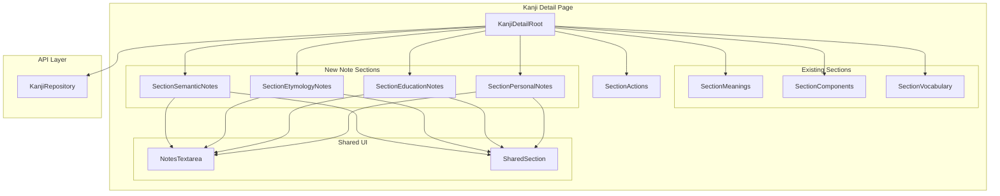
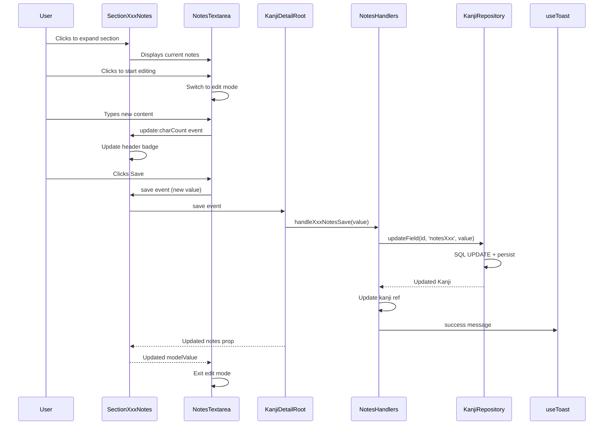

# Design Document: Kanji Detail Notes

## Overview

**Purpose**: This feature delivers inline editing for four kanji note fields (Education, Etymology, Semantic, Personal) with character count visibility, enabling researchers to document kanji insights directly within the detail page.

**Users**: Kanji researchers use these note sections to document etymology, semantic analysis, education/mnemonics, and personal observations.

**Impact**: Extends the refactored kanji detail page with four new Section components, one shared UI component, one handler composable, and a minor SharedSection enhancement.

### Goals

- Replicate all legacy note field functionality in refactored architecture
- Provide inline editing with save/cancel controls
- Display character count in collapsed section headers
- Position Semantic Analysis after Vocabulary, other notes after Stroke Order
- Maintain file size limits and component hierarchy standards

### Non-Goals

- No word count (character count only)
- No auto-save (explicit save action required)
- No rich text formatting (plain text only)
- No validation constraints on note length
- Stroke Order section implementation (existing or separate spec)

## Architecture

### Existing Architecture Analysis

The kanji detail page follows Root/Section/UI hierarchy:

- **KanjiDetailRoot** — Orchestrates all sections, manages data loading
- **KanjiDetailSection\*** — Individual section components (Headline, BasicInfo, Readings, Meanings, Components, Vocabulary)
- **UI Components** — Display and dialog components

Current section order in Root: Headline → BasicInfo → Readings → Meanings → Components → Vocabulary → Actions

Repository pattern: `useKanjiRepository()` provides `updateField(id, field, value)` for individual field updates.

### Architecture Pattern & Boundary Map



**Architecture Integration**:

- Selected pattern: Component hierarchy (Root/Section/UI) with handler composables
- Domain boundaries: Note sections are presentation-focused, delegate persistence to Root via events
- Existing patterns preserved: SharedSection for collapsible layout, repository for data access
- New components rationale: Four Section components for four note types, one shared textarea UI

### Technology Stack

| Layer      | Choice / Version        | Role in Feature                       | Notes                            |
| ---------- | ----------------------- | ------------------------------------- | -------------------------------- |
| Frontend   | Vue 3 + Composition API | Section components, composable        | Existing stack                   |
| State      | Ref + props/events      | Local edit state, parent coordination | No Pinia                         |
| Data       | SQLite via sql.js       | Note field persistence                | Via KanjiRepository              |
| UI Library | Reka UI                 | Collapsible sections                  | SharedSection uses Collapsible\* |

## Requirements Traceability

| Requirement | Summary                 | Components                              | Interfaces                  | Flows           |
| ----------- | ----------------------- | --------------------------------------- | --------------------------- | --------------- |
| 1.1-1.7     | Core note functionality | All 4 Section components, NotesTextarea | NotesSaveEvent              | Edit-Save flow  |
| 2.1-2.5     | Section positioning     | KanjiDetailRoot                         | —                           | Layout order    |
| 3.1-3.6     | Character count display | SharedSection, NotesTextarea            | headerExtra slot            | —               |
| 4.1-4.7     | Inline editing behavior | NotesTextarea                           | InlineTextareaProps         | —               |
| 5.1-5.7     | API layer support       | —                                       | KanjiRepository.updateField | Update flow     |
| 6.1-6.7     | Component architecture  | All new components                      | —                           | —               |
| 7.1-7.7     | Testing coverage        | Test files                              | —                           | —               |
| 8.1-8.6     | Legacy parity           | All components                          | —                           | All flows       |
| 9.1-9.6     | Design system           | SharedSection, NotesTextarea            | CSS variables               | —               |
| 10.1-10.6   | Error/loading states    | NotesTextarea, Root                     | Toast                       | Save error flow |

## Components and Interfaces

### Component Summary

| Component                   | Domain/Layer | Intent                            | Req Coverage | Key Dependencies             | Contracts    |
| --------------------------- | ------------ | --------------------------------- | ------------ | ---------------------------- | ------------ |
| KanjiSectionSemanticNotes   | Section      | Semantic analysis notes section   | 1, 2.1, 3, 4 | SharedSection, NotesTextarea | Event        |
| KanjiSectionEtymologyNotes  | Section      | Etymology notes section           | 1, 2.3, 3, 4 | SharedSection, NotesTextarea | Event        |
| KanjiSectionEducationNotes  | Section      | Education/mnemonics notes section | 1, 2.3, 3, 4 | SharedSection, NotesTextarea | Event        |
| KanjiSectionPersonalNotes   | Section      | Personal notes section            | 1, 2.3, 3, 4 | SharedSection, NotesTextarea | Event        |
| KanjiDetailNotesTextarea    | UI           | Inline editable textarea          | 4, 3.5       | BaseButton                   | Props/Events |
| SharedSection (enhanced)    | Shared       | Collapsible section wrapper       | 3.1-3.2, 9.2 | Reka Collapsible             | Slot         |
| useKanjiDetailNotesHandlers | Composable   | Note save handlers                | 5, 10        | KanjiRepository              | Function     |

### Section Layer

#### KanjiSectionSemanticNotes

| Field        | Detail                                   |
| ------------ | ---------------------------------------- |
| Intent       | Display and edit semantic analysis notes |
| Requirements | 1.1, 2.1, 3.1-3.6, 4.1-4.7               |

**Responsibilities & Constraints**

- Wraps NotesTextarea in SharedSection with collapsible behavior
- Passes character count to header slot
- Emits save events to parent Root
- Default open if content exists

**Dependencies**

- Inbound: KanjiDetailRoot provides notes value (P0)
- Outbound: SharedSection for layout (P0), NotesTextarea for editing (P0)

**Contracts**: Event [ ✓ ]

##### Props Interface

```typescript
interface KanjiSectionSemanticNotesProps {
  /** Current notes content */
  notes: string | null
}
```

##### Event Contract

```typescript
interface KanjiSectionSemanticNotesEmits {
  /** Emitted when notes are saved */
  (e: 'save', value: string | null): void
}
```

**Implementation Notes**

- Estimated size: ~60 lines (well under 250 limit)
- Test ID: `kanji-detail-semantic-notes`

---

#### KanjiSectionEtymologyNotes

| Field        | Detail                           |
| ------------ | -------------------------------- |
| Intent       | Display and edit etymology notes |
| Requirements | 1.1, 2.3, 3.1-3.6, 4.1-4.7       |

**Structure**: Identical to KanjiSectionSemanticNotes with different:

- Title: "Etymology Notes"
- Test ID: `kanji-detail-etymology-notes`
- Placeholder text

---

#### KanjiSectionEducationNotes

| Field        | Detail                                     |
| ------------ | ------------------------------------------ |
| Intent       | Display and edit education/mnemonics notes |
| Requirements | 1.1, 2.3, 3.1-3.6, 4.1-4.7                 |

**Structure**: Identical pattern with:

- Title: "Education & Mnemonics"
- Test ID: `kanji-detail-education-notes`
- Placeholder text

---

#### KanjiSectionPersonalNotes

| Field        | Detail                          |
| ------------ | ------------------------------- |
| Intent       | Display and edit personal notes |
| Requirements | 1.1, 2.3, 3.1-3.6, 4.1-4.7      |

**Structure**: Identical pattern with:

- Title: "Personal Notes"
- Test ID: `kanji-detail-personal-notes`
- Placeholder text

---

### UI Layer

#### KanjiDetailNotesTextarea

| Field        | Detail                                    |
| ------------ | ----------------------------------------- |
| Intent       | Inline editable textarea with save/cancel |
| Requirements | 4.1-4.7, 3.5                              |

**Responsibilities & Constraints**

- Display mode: Shows text or placeholder, click to edit
- Edit mode: Textarea with Save/Cancel buttons
- Tracks local edit state, syncs with prop on save/cancel
- Calculates and exposes character count
- No length validation (unconstrained text)
- Preserves line breaks and whitespace

**Dependencies**

- Inbound: Section components pass value, placeholder (P0)
- Outbound: BaseButton for actions (P0)

**Contracts**: Props [ ✓ ] / Events [ ✓ ]

##### Props Interface

```typescript
interface KanjiDetailNotesTextareaProps {
  /** Current saved value */
  modelValue: string | null
  /** Placeholder text for empty state */
  placeholder?: string
  /** Disable editing */
  disabled?: boolean
}
```

##### Event Contract

```typescript
interface KanjiDetailNotesTextareaEmits {
  /** Emitted when user saves changes */
  (e: 'save', value: string | null): void
  /** Emitted on every edit for real-time character count */
  (e: 'update:charCount', count: number): void
}
```

##### Exposed State

```typescript
/** Character count of current content (reactive) */
const charCount: ComputedRef<number>
```

**Implementation Notes**

- Similar to legacy `BaseInlineTextarea` but module-scoped
- Uses native `<textarea>` element
- Estimated size: ~100 lines
- Keyboard: Enter in textarea adds line, Escape cancels edit

---

### Shared Layer Enhancement

#### SharedSection (Enhancement)

| Field        | Detail                                          |
| ------------ | ----------------------------------------------- |
| Intent       | Add header-extra slot for character count badge |
| Requirements | 3.1-3.2, 9.2                                    |

**Enhancement Scope**

Add optional `#header-extra` slot to display content after title (e.g., character count badge).

##### Updated Template Structure

```vue
<div class="shared-section-header">
  <CollapsibleTrigger class="shared-section-trigger">
    <h2 class="shared-section-title">
      <span class="shared-section-trigger-icon">▶</span>
      {{ title }}
    </h2>
    <!-- NEW: Optional header extra content -->
    <slot name="header-extra" />
  </CollapsibleTrigger>
  <!-- existing actions slot -->
</div>
```

##### New CSS

```css
.shared-section-header-extra {
  margin-left: var(--spacing-sm);
  color: var(--color-text-muted);
  font-size: var(--font-size-sm);
  font-weight: var(--font-weight-normal);
}
```

**Implementation Notes**

- Backward compatible: slot is optional
- Update SharedSection.test.ts to cover new slot

---

### Composable Layer

#### useKanjiDetailNotesHandlers

| Field        | Detail                            |
| ------------ | --------------------------------- |
| Intent       | Handle note field save operations |
| Requirements | 5.1-5.7, 10.1-10.6                |

**Responsibilities & Constraints**

- Provides save handlers for each note type
- Uses `kanjiRepo.updateField()` for persistence
- Shows toast on success/error
- Updates local kanji ref on success

**Dependencies**

- Inbound: Root provides kanji ref (P0)
- Outbound: KanjiRepository (P0), useToast (P0)

**Contracts**: Service [ ✓ ]

##### Service Interface

```typescript
interface KanjiDetailNotesHandlers {
  handleSemanticNotesSave: (value: string | null) => void
  handleEtymologyNotesSave: (value: string | null) => void
  handleEducationNotesSave: (value: string | null) => void
  handlePersonalNotesSave: (value: string | null) => void
}

function useKanjiDetailNotesHandlers(
  kanji: Ref<Kanji | null>
): KanjiDetailNotesHandlers
```

**Implementation Notes**

- Estimated size: ~60 lines (well under 200 limit)
- All four handlers follow same pattern, different field names
- Error handling via toast.error()

---

### Root Integration

#### KanjiDetailRoot Updates

**Changes Required**:

1. Import new composable: `useKanjiDetailNotesHandlers`
2. Import four new Section components
3. Add Section components in correct positions:
   - After Vocabulary: `KanjiSectionSemanticNotes`
   - After Semantic (future Stroke Order): `KanjiSectionEtymologyNotes`, `KanjiSectionEducationNotes`, `KanjiSectionPersonalNotes`
4. Wire up save event handlers

**Estimated Impact**: ~15 additional lines to Root component

## Data Models

### Existing Schema (No Changes)

Note fields already exist in `kanjis` table:

| Column                    | Type | Nullable | Maps To                 |
| ------------------------- | ---- | -------- | ----------------------- |
| notes_etymology           | TEXT | Yes      | notesEtymology          |
| notes_semantic            | TEXT | Yes      | notesSemantic           |
| notes_education_mnemonics | TEXT | Yes      | notesEducationMnemonics |
| notes_personal            | TEXT | Yes      | notesPersonal           |

### Repository API (Existing)

```typescript
// Already available via KanjiRepository
updateField<K extends UpdatableField<Kanji>>(
  id: number,
  field: K,
  value: Kanji[K]
): Kanji
```

Usage:

```typescript
kanjiRepo.updateField(kanjiId, 'notesSemantic', newValue)
```

## System Flows

### Note Edit-Save Flow



## Error Handling

### Error Strategy

Note operations use simple try/catch with toast notifications.

### Error Categories and Responses

| Error Type      | Source                         | Response                           |
| --------------- | ------------------------------ | ---------------------------------- |
| Save failure    | Repository exception           | Toast error, keep edit mode active |
| Kanji not found | Repository EntityNotFoundError | Toast error, likely stale page     |
| Database error  | sql.js failure                 | Toast error with message           |

### Monitoring

Errors logged to console (development), toast shown to user.

## Testing Strategy

### Unit Tests

| Test File                                 | Coverage                                                 |
| ----------------------------------------- | -------------------------------------------------------- |
| `KanjiDetailNotesTextarea.test.ts`        | Display mode, edit mode, save/cancel, character count    |
| `KanjiSectionSemanticNotes.test.ts`       | Props rendering, event emission, character count display |
| `KanjiSectionEtymologyNotes.test.ts`      | Props rendering, event emission                          |
| `KanjiSectionEducationNotes.test.ts`      | Props rendering, event emission                          |
| `KanjiSectionPersonalNotes.test.ts`       | Props rendering, event emission                          |
| `use-kanji-detail-notes-handlers.test.ts` | All four save handlers, error handling                   |
| `SharedSection.test.ts`                   | Existing tests + new header-extra slot                   |

### E2E Tests

Add to existing `e2e/kanji-detail.test.ts`:

| Test Case                                 | Assertions                        |
| ----------------------------------------- | --------------------------------- |
| View collapsed notes with character count | Character count visible in header |
| Expand notes section                      | Textarea becomes visible          |
| Edit and save semantic notes              | New content persists after reload |
| Edit and cancel etymology notes           | Original content restored         |
| Edit all four note types                  | Each saves independently          |

**Test IDs**:

- `kanji-detail-semantic-notes`
- `kanji-detail-semantic-notes-textarea`
- `kanji-detail-semantic-notes-save-button`
- `kanji-detail-semantic-notes-cancel-button`
- `kanji-detail-semantic-notes-char-count`
- (Similar patterns for etymology, education, personal)

## File Organization

### New Files

```
src/modules/kanji-detail/
├── components/
│   ├── KanjiSectionSemanticNotes.vue        (~60 lines)
│   ├── KanjiSectionSemanticNotes.test.ts
│   ├── KanjiSectionEtymologyNotes.vue       (~60 lines)
│   ├── KanjiSectionEtymologyNotes.test.ts
│   ├── KanjiSectionEducationNotes.vue       (~60 lines)
│   ├── KanjiSectionEducationNotes.test.ts
│   ├── KanjiSectionPersonalNotes.vue        (~60 lines)
│   ├── KanjiSectionPersonalNotes.test.ts
│   ├── KanjiDetailNotesTextarea.vue         (~100 lines)
│   └── KanjiDetailNotesTextarea.test.ts
└── composables/
    ├── use-kanji-detail-notes-handlers.ts   (~60 lines)
    └── use-kanji-detail-notes-handlers.test.ts
```

### Modified Files

```
src/shared/components/
├── SharedSection.vue                        (add ~10 lines for slot)
└── SharedSection.test.ts                    (add slot tests)

src/modules/kanji-detail/components/
└── KanjiDetailRoot.vue                      (add ~15 lines for imports and sections)

e2e/
└── kanji-detail.test.ts                     (add note section tests)
```

### Estimated Total New Code

- Components: ~340 lines
- Composable: ~60 lines
- Tests: ~400 lines
- Total: ~800 lines across 12 new files (average 67 lines/file)
