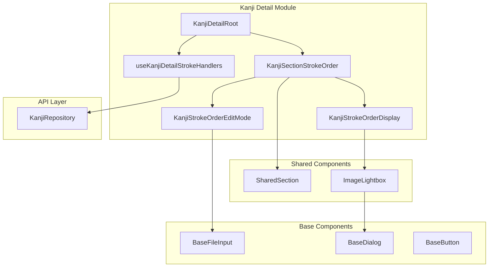

# Design Document: Kanji Detail Stroke Order Section

## Overview

**Purpose**: Enable users to view, upload, and manage stroke order diagrams and animations for kanji characters with a mobile-friendly viewing experience.

**Users**: Japanese language learners who document kanji with visual stroke order references.

**Impact**: Adds new section to kanji detail page between Semantic Notes and Notes Group. Introduces two new shared components: `ImageLightbox` and `BaseFileInput`.

### Goals

- Replicate all legacy stroke order functionality (view, upload, remove diagram/animation)
- Provide responsive image display that works well on mobile and desktop
- Enable click-to-enlarge with zoom/pan for detailed viewing
- Follow established module patterns (SharedSection, composable handlers)
- Maintain proper blob URL memory management

### Non-Goals

- Image editing/cropping (upload only)
- Automatic stroke order generation
- Integration with external stroke order APIs
- Video support (GIF animations only)

## Architecture

### Existing Architecture Analysis

The kanji-detail module follows established patterns:

- **Root component** orchestrates data and handlers
- **Section components** wrap SharedSection with domain-specific content
- **Handler composables** use `kanjiRepo.updateField()` for saves
- **SharedSection** provides consistent collapsible layout

The API layer already supports stroke images:

- `Kanji.strokeDiagramImage: Uint8Array | null`
- `Kanji.strokeGifImage: Uint8Array | null`
- `kanjiRepo.updateField(id, 'strokeDiagramImage', value)` works

### Architecture Pattern & Boundary Map



**Architecture Integration**:

- Selected pattern: Section component with view/edit modes (consistent with notes sections)
- Domain boundary: Stroke order is a kanji-detail concern, reusable components go to shared/base
- Existing patterns preserved: SharedSection, composable handlers, updateField API
- New components: ImageLightbox (shared), BaseFileInput (base)
- Steering compliance: File size limits, component hierarchy, TypeScript strict

### Technology Stack

| Layer         | Choice / Version     | Role in Feature         | Notes                       |
| ------------- | -------------------- | ----------------------- | --------------------------- |
| Frontend      | Vue 3 + TypeScript   | Section UI, composables | Existing stack              |
| UI Primitives | Reka UI Dialog       | Lightbox accessibility  | Focus trap, escape handling |
| Storage       | SQLite (sql.js) BLOB | Image persistence       | Via existing repository     |
| Memory        | Blob URL API         | Image preview display   | With lifecycle management   |

## Requirements Traceability

| Requirement | Summary            | Components                                       | Interfaces                    | Flows         |
| ----------- | ------------------ | ------------------------------------------------ | ----------------------------- | ------------- |
| 1.1-1.5     | Section display    | KanjiSectionStrokeOrder, KanjiStrokeOrderDisplay | StrokeOrderDisplayProps       | View flow     |
| 2.1-2.9     | Responsive viewing | ImageLightbox, KanjiStrokeOrderDisplay           | ImageLightboxProps            | Lightbox flow |
| 3.1-3.7     | Upload and edit    | KanjiStrokeOrderEditMode, BaseFileInput          | FileInputProps, EditModeProps | Edit flow     |
| 4.1-4.5     | API layer          | KanjiRepository                                  | updateField                   | —             |
| 5.1-5.4     | Memory management  | useBlobUrl composable                            | —                             | —             |
| 6.1-6.5     | Accessibility      | ImageLightbox, BaseFileInput                     | —                             | —             |
| 7.1-7.6     | Test coverage      | All components                                   | —                             | —             |

## Components and Interfaces

### Summary

| Component                    | Domain/Layer            | Intent                                       | Req Coverage | Key Dependencies     | Contracts              |
| ---------------------------- | ----------------------- | -------------------------------------------- | ------------ | -------------------- | ---------------------- |
| KanjiSectionStrokeOrder      | kanji-detail/Section    | Orchestrate stroke order display and editing | 1, 3         | SharedSection (P0)   | Props, Events          |
| KanjiStrokeOrderDisplay      | kanji-detail/UI         | Display stroke images with lightbox trigger  | 1, 2         | ImageLightbox (P0)   | Props                  |
| KanjiStrokeOrderEditMode     | kanji-detail/UI         | File inputs for image upload/remove          | 3            | BaseFileInput (P0)   | Props, Events          |
| ImageLightbox                | shared/UI               | Fullscreen image viewer with zoom            | 2, 6         | BaseDialog (P0)      | Props, Events          |
| BaseFileInput                | base/UI                 | File upload with preview                     | 3            | None                 | Props, Events, v-model |
| useBlobUrl                   | kanji-detail/composable | Blob URL lifecycle management                | 5            | None                 | Function               |
| useKanjiDetailStrokeHandlers | kanji-detail/composable | Save handlers for stroke images              | 4            | KanjiRepository (P0) | Function               |

### Kanji Detail Module

#### KanjiSectionStrokeOrder

| Field        | Detail                                                    |
| ------------ | --------------------------------------------------------- |
| Intent       | Section wrapper managing view/edit mode for stroke images |
| Requirements | 1.1-1.5, 3.1-3.7                                          |

**Responsibilities & Constraints**

- Wrap content in SharedSection with collapsible behavior
- Toggle between view and edit modes
- Emit save events to parent for persistence
- Default open if images exist

**Dependencies**

- Inbound: KanjiDetailRoot — provides image data and receives save events (P0)
- Internal: SharedSection, KanjiStrokeOrderDisplay, KanjiStrokeOrderEditMode (P0)

**Contracts**: State [x]

##### Props Interface

```typescript
interface KanjiSectionStrokeOrderProps {
  /** Stroke diagram image data */
  strokeDiagram: Uint8Array | null
  /** Stroke animation GIF data */
  strokeGif: Uint8Array | null
}
```

##### Events Interface

```typescript
interface KanjiSectionStrokeOrderEmits {
  /** Emitted when diagram is saved */
  'save:diagram': [value: Uint8Array | null]
  /** Emitted when animation is saved */
  'save:animation': [value: Uint8Array | null]
}
```

**Implementation Notes**

- Use SharedSection with `collapsible` and `default-open` based on content presence
- Edit mode toggles between Display and EditMode components
- Cancel reverts to props values; save emits to parent

---

#### KanjiStrokeOrderDisplay

| Field        | Detail                                                    |
| ------------ | --------------------------------------------------------- |
| Intent       | Display stroke images as thumbnails with lightbox trigger |
| Requirements | 1.1-1.3, 2.1-2.9                                          |

**Responsibilities & Constraints**

- Display thumbnails constrained to max 200x200px
- Show magnify icon affordance on each image
- Open ImageLightbox on click
- Handle empty state message
- Manage blob URLs for display

**Dependencies**

- Internal: ImageLightbox, useBlobUrl composable (P0)

**Contracts**: Props [x]

##### Props Interface

```typescript
interface KanjiStrokeOrderDisplayProps {
  /** Stroke diagram image data */
  strokeDiagram: Uint8Array | null
  /** Stroke animation GIF data */
  strokeGif: Uint8Array | null
}
```

**Implementation Notes**

- Grid layout with figure/figcaption for each image
- Thumbnail wrapper is button for keyboard accessibility
- SVG magnify icon overlay in corner

---

#### KanjiStrokeOrderEditMode

| Field        | Detail                                           |
| ------------ | ------------------------------------------------ |
| Intent       | File inputs for uploading/removing stroke images |
| Requirements | 3.1-3.7                                          |

**Responsibilities & Constraints**

- Two BaseFileInput components (diagram, animation)
- Track local edit state (not props directly)
- Provide save/cancel actions
- Preview uploaded files

**Dependencies**

- Internal: BaseFileInput (P0)

**Contracts**: Props [x], Events [x]

##### Props Interface

```typescript
interface KanjiStrokeOrderEditModeProps {
  /** Initial diagram value for editing */
  strokeDiagram: Uint8Array | null
  /** Initial animation value for editing */
  strokeGif: Uint8Array | null
}
```

##### Events Interface

```typescript
interface KanjiStrokeOrderEditModeEmits {
  /** Emitted when user saves changes */
  save: [diagram: Uint8Array | null, animation: Uint8Array | null]
  /** Emitted when user cancels editing */
  cancel: []
}
```

**Implementation Notes**

- Accept filters: `image/*` for diagram, `image/gif` for animation
- Size limits: warning at 500KB, max 2MB
- Local refs track edit state; reset on cancel

---

#### useKanjiDetailStrokeHandlers

| Field        | Detail                                                    |
| ------------ | --------------------------------------------------------- |
| Intent       | Handler functions for saving stroke images via repository |
| Requirements | 4.1-4.5                                                   |

**Responsibilities & Constraints**

- Call `kanjiRepo.updateField()` for each image field
- Show toast notifications on success/error
- Update reactive kanji ref with returned entity

**Dependencies**

- Outbound: KanjiRepository — updateField method (P0)
- Outbound: useToast — notifications (P1)

**Contracts**: Service [x]

##### Service Interface

```typescript
interface KanjiDetailStrokeHandlers {
  handleDiagramSave: (value: Uint8Array | null) => void
  handleAnimationSave: (value: Uint8Array | null) => void
}

function useKanjiDetailStrokeHandlers(
  kanji: Ref<Kanji | null>
): KanjiDetailStrokeHandlers
```

**Implementation Notes**

- Pattern matches useKanjiDetailNotesHandlers exactly
- Each handler: validate kanji exists, call updateField, update ref, toast

---

#### useBlobUrl

| Field        | Detail                                            |
| ------------ | ------------------------------------------------- |
| Intent       | Composable for safe blob URL lifecycle management |
| Requirements | 5.1-5.4                                           |

**Responsibilities & Constraints**

- Create blob URL from Uint8Array with MIME detection
- Track URL for cleanup
- Revoke previous URL when data changes
- Revoke on component unmount

**Contracts**: Service [x]

##### Service Interface

```typescript
interface UseBlobUrlReturn {
  /** Reactive blob URL (null if no data) */
  url: Ref<string | null>
}

function useBlobUrl(
  data: Ref<Uint8Array | null> | (() => Uint8Array | null)
): UseBlobUrlReturn
```

**Implementation Notes**

- Watch data source, revoke old URL, create new
- `onUnmounted` revokes any active URL
- MIME detection: check magic bytes for PNG (89 50 4E 47), JPEG (FF D8), GIF (47 49 46)

---

### Shared Components

#### ImageLightbox

| Field        | Detail                                              |
| ------------ | --------------------------------------------------- |
| Intent       | Fullscreen overlay for viewing images with zoom/pan |
| Requirements | 2.1-2.9, 6.1-6.4                                    |

**Responsibilities & Constraints**

- Fullscreen overlay with centered image
- Close on backdrop click, close button, or Escape
- Enable touch zoom via CSS touch-action
- Allow scroll/pan for large images
- Preserve GIF animation
- Trap focus while open

**Dependencies**

- Internal: BaseDialog (underlying primitives) or Reka Dialog directly (P0)

**Contracts**: Props [x], Events [x]

##### Props Interface

```typescript
interface ImageLightboxProps {
  /** Whether lightbox is open */
  open: boolean
  /** Image source URL (blob URL or regular URL) */
  src: string
  /** Alt text for accessibility */
  alt: string
}
```

##### Events Interface

```typescript
interface ImageLightboxEmits {
  /** Emitted when lightbox should close */
  'update:open': [value: boolean]
}
```

**Implementation Notes**

- Use Reka DialogRoot/Portal/Overlay/Content for accessibility
- Image inside scrollable container with touch-action: pinch-zoom pan-x pan-y
- Close button in corner; overlay click closes
- No max-width/height on image inside lightbox (allow natural size)

---

### Base Components

#### BaseFileInput

| Field        | Detail                                            |
| ------------ | ------------------------------------------------- |
| Intent       | File upload component with preview and validation |
| Requirements | 3.1-3.5, 6.5                                      |

**Responsibilities & Constraints**

- v-model with Uint8Array | null
- Drag-and-drop support
- Preview generation from uploaded file
- Size validation (warning + hard limit)
- Accept filter prop
- Keyboard accessible
- Proper labeling for screen readers

**Dependencies**

- None (base component)

**Contracts**: Props [x], Events [x]

##### Props Interface

```typescript
interface BaseFileInputProps {
  /** Input label */
  label?: string
  /** Accepted file types (e.g., 'image/*', 'image/gif') */
  accept?: string
  /** External error message */
  error?: string
  /** Disable the input */
  disabled?: boolean
  /** Soft size limit in bytes (shows warning) */
  warningSizeBytes?: number
  /** Hard size limit in bytes (prevents upload) */
  maxSizeBytes?: number
}
```

##### v-model Interface

```typescript
// v-model binding
modelValue: Uint8Array | null
```

**Implementation Notes**

- Migrate from legacy with same functionality
- Default limits: 500KB warning, 2MB max
- Preview via blob URL with cleanup
- Drop zone with visual feedback

---

## Data Models

### Domain Model

No new entities. Uses existing `Kanji` entity fields:

```typescript
interface Kanji {
  // ... other fields
  strokeDiagramImage: Uint8Array | null
  strokeGifImage: Uint8Array | null
}
```

### Physical Data Model

Existing schema (no changes):

| Column               | Type | Description                 |
| -------------------- | ---- | --------------------------- |
| stroke_diagram_image | BLOB | Static stroke order diagram |
| stroke_gif_image     | BLOB | Animated stroke order GIF   |

## Error Handling

### Error Categories

| Error Type            | Handling        | User Message                                |
| --------------------- | --------------- | ------------------------------------------- |
| File too large        | Prevent upload  | "File too large. Maximum size is 2 MB"      |
| Invalid file type     | Prevent upload  | "Invalid file type. Please select an image" |
| Save failure          | Toast error     | "Failed to save stroke image"               |
| Blob creation failure | Silent fallback | Show placeholder or empty                   |

## Testing Strategy

### Unit Tests

- **KanjiSectionStrokeOrder**: View/edit mode toggle, event emission
- **KanjiStrokeOrderDisplay**: Thumbnail rendering, empty state, lightbox trigger
- **KanjiStrokeOrderEditMode**: File input interaction, save/cancel
- **ImageLightbox**: Open/close, keyboard handling
- **BaseFileInput**: Upload, preview, validation, drag-drop
- **useBlobUrl**: URL creation, MIME detection, cleanup
- **useKanjiDetailStrokeHandlers**: Save calls, toast notifications

### E2E Tests

- View stroke images on kanji detail page
- Upload new stroke diagram
- Upload new stroke animation (GIF)
- Remove existing stroke image
- Click to open lightbox and close
- Verify images persist after page reload
